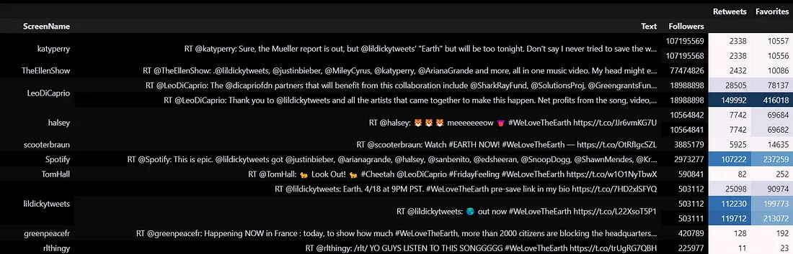
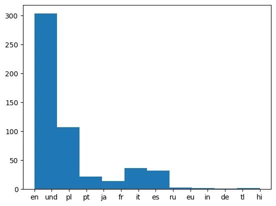

🕵️
======================================

Although we may not be enthusiastic Twitter users, we acknowledge its significant impact on the world (especially with famous figures like Trump known for his tweets). The data available on Twitter is not only valuable for gaining insights, but what’s even more impressive is that we can analyze Twitter storms almost in real-time. This enables us to understand the prevailing thoughts and emotions worldwide as they unfold.

However, like a well-guarded treasure, Twitter has security measures in place that prevent us from accessing the data immediately. Some authentication procedures, which are relatively straightforward, must be followed to retrieve data through their APIs. Fortunately, since our objective today is to learn how to extract insights from data, we have already obtained the necessary authorization.

Project Description
-------------------

In this project, we’ll analyze the trending Twitter topics around the US and Worldwide.

Our data is now accessible [_here_](https://github.com/sahaavi/Real-Time-Twitter-Data-Insights/tree/main/data), allowing us to focus on the exciting part of our journey!

As a bonus, I will provide the [_scripts_](https://github.com/sahaavi/Real-Time-Twitter-Data-Insights/blob/main/api_data_collection.ipynb)  on how to retrieve the data using the API towards the end of this post. To utilize them, you will need to subscribe to at least the basic plan of the Twitter API, which currently has a monthly cost of $100. However, if you’re interested in scraping Twitter data without incurring any costs (but be cautious as there is a risk of being banned), you can find more information [here](https://github.com/sahaavi/Web-Scraping/tree/main/Selenium).

Let’s get started! 💪

Step 0: Load the JSON data files
--------------------------------

To start, let’s read the data files that contain information about the trending topics. The files include an array of `trend` objects that encode the name of the trending topic, the query parameter that can be used to search for the topic on [Twitter Search](http://search.twitter.com/), the Twitter Search URL, whether the topic is promoted or not, and the tweet volume (the number of tweets that contain the topic).

```python
# Loading json module  
import json  
  
# Load WW_trends and US_trends data  
with open('data/WWTrends.json') as file:  
    json_content = file.read()  
    WW_trends = json.loads(json_content)  
  
with open('data/USTrends.json') as file:  
    json_content = file.read()  
    US_trends = json.loads(json_content)  
  
# Print data  
print("WW_trends:")  
print(WW_trends)  
print("US_trends:")  
print(US_trends)
```

The data we have is difficult to read, as you can see in the chunk below!

```
WW_trends:  
[{'trends': [{'name': '#BeratKandili', 'url': 'http://twitter.com/search?q=%23BeratKandili', 'promoted_content': None, 'query': '%23BeratKandili', 'tweet_volume': 46373}, {'name': '#GoodFriday', 'url': 'http://twitter.com/search?q=%23GoodFriday', 'promoted_content': None, 'query': '%23GoodFriday', 'tweet_volume': 81891}, {'name': '#WeLoveTheEarth', 'url': 'http://twitter.com/search?q=%23WeLoveTheEarth', 'promoted_content': None, 'query': '%23WeLoveTheEarth', 'tweet_volume': 159698}, {'name': '#195TLdenTTVerilir', 'url': 'http://twitter.com/search?q=%23195TLdenTTVerilir', 'promoted_content': None, 'query': '%23195TLdenTTVerilir', 'tweet_volume': None}, {'name': '#AFLNorthDons', 'url': 'http://twitter.com/search?q=%23AFLNorthDons', 'promoted_content': None, 'query': '%23AFLNorthDons', 'tweet_volume': None}, {'name': 'Shiv Sena', 'url': 'http://twitter.com/search?q=%22Shiv+Sena%22', 'promoted_content': None, 'query': '%22Shiv+Sena%22', 'tweet_volume': None}, {'name': 'Lyra McKee', 'url': 'http://twitter.com/search?q=%22Lyra+McKee%22', 'promoted_content': None, 'query': '%22Lyra+McKee%22', 'tweet_volume': 17606}, {'name': 'Priyanka Chaturvedi', 'url': 'http://twitter.com/search?q=%22Priyanka+Chaturvedi%22', 'promoted_content': None, 'query': '%22Priyanka+Chaturvedi%22', 'tweet_volume': 22342}, {'name': 'Derry', 'url': 'http://twitter.com/search?q=Derry', 'promoted_content': None, 'query': 'Derry', 'tweet_volume': 28234}, {'name': '池袋の事故', 'url': 'http://twitter.com/search?q=%E6%B1%A0%E8%A2%8B%E3%81%AE%E4%BA%8B%E6%95%85', 'promoted_content': None, 'query': '%E6%B1%A0%E8%A2%8B%E3%81%AE%E4%BA%8B%E6%95%85', 'tweet_volume': 34381}, {'name': 'プリウス', 'url': 'http://twitter.com/search?q=%E3%83%97%E3%83%AA%E3%82%A6%E3%82%B9', 'promoted_content': None, 'query': '%E3%83%97%E3%83%AA%E3%82%A6%E3%82%B9', 'tweet_volume': 22944}, {'name': 'Hemant Karkare', 'url': 'http://twitter.com/search?q=%22Hemant+Karkare%22', 'promoted_content': None, 'query': '%22Hemant+Karkare%22', 'tweet_volume': 24067}, {'name': '高齢者', 'url': 'http://twitter.com/search?q=%E9%AB%98%E9%BD%A2%E8%80%85', 'promoted_content': None, 'query': '%E9%AB%98%E9%BD%A2%E8%80%85', 'tweet_volume': 28382}, {'name': '브이알', 'url': 'http://twitter.com/search?q=%EB%B8%8C%EC%9D%B4%EC%95%8C', 'promoted_content': None, 'query': '%EB%B8%8C%EC%9D%B4%EC%95%8C', 'tweet_volume': 15490}, {'name': '刀ステ', 'url': 'http://twitter.com/search?q=%E5%88%80%E3%82%B9%E3%83%86', 'promoted_content': None, 'query': '%E5%88%80%E3%82%B9%E3%83%86', 'tweet_volume': None}, {'name': '免許返納', 'url': 'http://twitter.com/search?q=%E5%85%8D%E8%A8%B1%E8%BF%94%E7%B4%8D', 'promoted_content': None, 'query': '%E5%85%8D%E8%A8%B1%E8%BF%94%E7%B4%8D', 'tweet_volume': None}, {'name': 'Berat Kandilimiz', 'url': 'http://twitter.com/search?q=%22Berat+Kandilimiz%22', 'promoted_content': None, 'query': '%22Berat+Kandilimiz%22', 'tweet_volume': 10901}, {'name': 'örgütdeğil arkadaşgrubu', 'url': 'http://twitter.com/search?q=%22%C3%B6rg%C3%BCtde%C4%9Fil+arkada%C5%9Fgrubu%22', 'promoted_content': None, 'query': '%22%C3%B6rg%C3%BCtde%C4%9Fil+arkada%C5%9Fgrubu%22', 'tweet_volume': None}, {'name': 'グレア', 'url': 'http://twitter.com/search?q=%E3%82%B0%E3%83%AC%E3%82%A2', 'promoted_content': None, 'query': '%E3%82%B0%E3%83%AC%E3%82%A2', 'tweet_volume': 23485}, {'name': '東京・池袋衝突事故', 'url': 'http://twitter.com/search?q=%E6%9D%B1%E4%BA%AC%E3%83%BB%E6%B1%A0%E8%A2%8B%E8%A1%9D%E7%AA%81%E4%BA%8B%E6%95%85', 'promoted_content': None, 'query': '%E6%9D%B1%E4%BA%AC%E3%83%BB%E6%B1%A0%E8%A2%8B%E8%A1%9D%E7%AA%81%E4%BA%8B%E6%95%85', 'tweet_volume': None}, {'name': '重体の女性と女児', 'url': 'http://twitter.com/search?q=%E9%87%8D%E4%BD%93%E3%81%AE%E5%A5%B3%E6%80%A7%E3%81%A8%E5%A5%B3%E5%85%90', 'promoted_content': None, 'query': '%E9%87%8D%E4%BD%93%E3%81%AE%E5%A5%B3%E6%80%A7%E3%81%A8%E5%A5%B3%E5%85%90', 'tweet_volume': None}, {'name': 'Lil Dicky', 'url': 'http://twitter.com/search?q=%22Lil+Dicky%22', 'promoted_content': None, 'query': '%22Lil+Dicky%22', 'tweet_volume': 42461}, {'name': '歩行者', 'url': 'http://twitter.com/search?q=%E6%AD%A9%E8%A1%8C%E8%80%85', 'promoted_content': None, 'query': '%E6%AD%A9%E8%A1%8C%E8%80%85', 'tweet_volume': 25405}, {'name': 'Derrick White', 'url': 'http://twitter.com/search?q=%22Derrick+White%22', 'promoted_content': None, 'query': '%22Derrick+White%22', 'tweet_volume': 27104}, {'name': '十二国記', 'url': 'http://twitter.com/search?q=%E5%8D%81%E4%BA%8C%E5%9B%BD%E8%A8%98', 'promoted_content': None, 'query': '%E5%8D%81%E4%BA%8C%E5%9B%BD%E8%A8%98', 'tweet_volume': 46803}, {'name': '#KpuJanganCurang', 'url': 'http://twitter.com/search?q=%23KpuJanganCurang', 'promoted_content': None, 'query': '%23KpuJanganCurang', 'tweet_volume': 75384}, {'name': '#HayırlıCumalar', 'url': 'http://twitter.com/search?q=%23Hay%C4%B1rl%C4%B1Cumalar', 'promoted_content': None, 'query': '%23Hay%C4%B1rl%C4%B1Cumalar', 'tweet_volume': 19848}, {'name': '#HayırlıKandiller', 'url': 'http://twitter.com/search?q=%23Hay%C4%B1rl%C4%B1Kandiller', 'promoted_content': None, 'query': '%23Hay%C4%B1rl%C4%B1Kandiller', 'tweet_volume': None}, {'name': '#HanumanJayanti', 'url': 'http://twitter.com/search?q=%23HanumanJayanti', 'promoted_content': None, 'query': '%23HanumanJayanti', 'tweet_volume': 83138}, {'name': '#IndonesianElectionHeroes', 'url': 'http://twitter.com/search?q=%23IndonesianElectionHeroes', 'promoted_content': None, 'query': '%23IndonesianElectionHeroes', 'tweet_volume': 19664}, {'name': '#يوم_الجمعه', 'url': 'http://twitter.com/search?q=%23%D9%8A%D9%88%D9%85_%D8%A7%D9%84%D8%AC%D9%85%D8%B9%D9%87', 'promoted_content': None, 'query': '%23%D9%8A%D9%88%D9%85_%D8%A7%D9%84%D8%AC%D9%85%D8%B9%D9%87', 'tweet_volume': 80799}, {'name': '#NRLBulldogsSouths', 'url': 'http://twitter.com/search?q=%23NRLBulldogsSouths', 'promoted_content': None, 'query': '%23NRLBulldogsSouths', 'tweet_volume': None}, {'name': '#NikahUmurBerapa', 'url': 'http://twitter.com/search?q=%23NikahUmurBerapa', 'promoted_content': None, 'query': '%23NikahUmurBerapa', 'tweet_volume': None}, {'name': '#DragRace', 'url': 'http://twitter.com/search?q=%23DragRace', 'promoted_content': None, 'query': '%23DragRace', 'tweet_volume': 37166}, {'name': '#ViernesSanto', 'url': 'http://twitter.com/search?q=%23ViernesSanto', 'promoted_content': None, 'query': '%23ViernesSanto', 'tweet_volume': None}, {'name': '#HardikPatel', 'url': 'http://twitter.com/search?q=%23HardikPatel', 'promoted_content': None, 'query': '%23HardikPatel', 'tweet_volume': None}, {'name': '#BLACKPINKxCorden', 'url': 'http://twitter.com/search?q=%23BLACKPINKxCorden', 'promoted_content': None, 'query': '%23BLACKPINKxCorden', 'tweet_volume': 253605}, {'name': '#Ontas', 'url': 'http://twitter.com/search?q=%23Ontas', 'promoted_content': None, 'query': '%23Ontas', 'tweet_volume': 27924}, {'name': '#ConCalmaRemix', 'url': 'http://twitter.com/search?q=%23ConCalmaRemix', 'promoted_content': None, 'query': '%23ConCalmaRemix', 'tweet_volume': 37846}, {'name': '#ProtestoEdiyorum', 'url': 'http://twitter.com/search?q=%23ProtestoEdiyorum', 'promoted_content': None, 'query': '%23ProtestoEdiyorum', 'tweet_volume': None}, {'name': '#DinahJane1', 'url': 'http://twitter.com/search?q=%23DinahJane1', 'promoted_content': None, 'query': '%23DinahJane1', 'tweet_volume': 23757}, {'name': '#ShivSena', 'url': 'http://twitter.com/search?q=%23ShivSena', 'promoted_content': None, 'query': '%23ShivSena', 'tweet_volume': None}, {'name': '#DuyguAsena', 'url': 'http://twitter.com/search?q=%23DuyguAsena', 'promoted_content': None, 'query': '%23DuyguAsena', 'tweet_volume': None}, {'name': '#TheJudasInMyLife', 'url': 'http://twitter.com/search?q=%23TheJudasInMyLife', 'promoted_content': None, 'query': '%23TheJudasInMyLife', 'tweet_volume': None}, {'name': '#Jersey', 'url': 'http://twitter.com/search?q=%23Jersey', 'promoted_content': None, 'query': '%23Jersey', 'tweet_volume': 20509}, {'name': '#اغلاق_BBM', 'url': 'http://twitter.com/search?q=%23%D8%A7%D8%BA%D9%84%D8%A7%D9%82_BBM', 'promoted_content': None, 'query': '%23%D8%A7%D8%BA%D9%84%D8%A7%D9%82_BBM', 'tweet_volume': 17055}, {'name': '#19aprile', 'url': 'http://twitter.com/search?q=%2319aprile', 'promoted_content': None, 'query': '%2319aprile', 'tweet_volume': None}, {'name': '#CHIvLIO', 'url': 'http://twitter.com/search?q=%23CHIvLIO', 'promoted_content': None, 'query': '%23CHIvLIO', 'tweet_volume': None}, {'name': '#Karfreitag', 'url': 'http://twitter.com/search?q=%23Karfreitag', 'promoted_content': None, 'query': '%23Karfreitag', 'tweet_volume': None}, {'name': '#JunquerasACN', 'url': 'http://twitter.com/search?q=%23JunquerasACN', 'promoted_content': None, 'query': '%23JunquerasACN', 'tweet_volume': None}], 'as_of': '2019-04-19T08:43:43Z', 'created_at': '2019-04-19T08:39:15Z', 'locations': [{'name': 'Worldwide', 'woeid': 1}]}]  
US_trends:  
[{'trends': [{'name': '#WeLoveTheEarth', 'url': 'http://twitter.com/search?q=%23WeLoveTheEarth', 'promoted_content': None, 'query': '%23WeLoveTheEarth', 'tweet_volume': 159698}, {'name': '#DragRace', 'url': 'http://twitter.com/search?q=%23DragRace', 'promoted_content': None, 'query': '%23DragRace', 'tweet_volume': 37166}, {'name': 'Lil Dicky', 'url': 'http://twitter.com/search?q=%22Lil+Dicky%22', 'promoted_content': None, 'query': '%22Lil+Dicky%22', 'tweet_volume': 42461}, {'name': 'Derrick White', 'url': 'http://twitter.com/search?q=%22Derrick+White%22', 'promoted_content': None, 'query': '%22Derrick+White%22', 'tweet_volume': 27104}, {'name': '#CUZILOVEYOU', 'url': 'http://twitter.com/search?q=%23CUZILOVEYOU', 'promoted_content': None, 'query': '%23CUZILOVEYOU', 'tweet_volume': None}, {'name': 'Kevin Durant', 'url': 'http://twitter.com/search?q=%22Kevin+Durant%22', 'promoted_content': None, 'query': '%22Kevin+Durant%22', 'tweet_volume': 21870}, {'name': '#StarTrekDiscovery', 'url': 'http://twitter.com/search?q=%23StarTrekDiscovery', 'promoted_content': None, 'query': '%23StarTrekDiscovery', 'tweet_volume': None}, {'name': '#GSWvsLAC', 'url': 'http://twitter.com/search?q=%23GSWvsLAC', 'promoted_content': None, 'query': '%23GSWvsLAC', 'tweet_volume': None}, {'name': 'Oshie', 'url': 'http://twitter.com/search?q=Oshie', 'promoted_content': None, 'query': 'Oshie', 'tweet_volume': None}, {'name': 'Seth Abramson', 'url': 'http://twitter.com/search?q=%22Seth+Abramson%22', 'promoted_content': None, 'query': '%22Seth+Abramson%22', 'tweet_volume': None}, {'name': 'Lyra McKee', 'url': 'http://twitter.com/search?q=%22Lyra+McKee%22', 'promoted_content': None, 'query': '%22Lyra+McKee%22', 'tweet_volume': 17606}, {'name': 'Silky', 'url': 'http://twitter.com/search?q=Silky', 'promoted_content': None, 'query': 'Silky', 'tweet_volume': 12881}, {'name': 'Kazuo Koike', 'url': 'http://twitter.com/search?q=%22Kazuo+Koike%22', 'promoted_content': None, 'query': '%22Kazuo+Koike%22', 'tweet_volume': None}, {'name': 'Game 6', 'url': 'http://twitter.com/search?q=%22Game+6%22', 'promoted_content': None, 'query': '%22Game+6%22', 'tweet_volume': None}, {'name': 'Yvie', 'url': 'http://twitter.com/search?q=Yvie', 'promoted_content': None, 'query': 'Yvie', 'tweet_volume': 10680}, {'name': 'Gallant', 'url': 'http://twitter.com/search?q=Gallant', 'promoted_content': None, 'query': 'Gallant', 'tweet_volume': None}, {'name': 'Lone Wolf and Cub', 'url': 'http://twitter.com/search?q=%22Lone+Wolf+and+Cub%22', 'promoted_content': None, 'query': '%22Lone+Wolf+and+Cub%22', 'tweet_volume': None}, {'name': 'George Conway', 'url': 'http://twitter.com/search?q=%22George+Conway%22', 'promoted_content': None, 'query': '%22George+Conway%22', 'tweet_volume': 27458}, {'name': 'David Fletcher', 'url': 'http://twitter.com/search?q=%22David+Fletcher%22', 'promoted_content': None, 'query': '%22David+Fletcher%22', 'tweet_volume': None}, {'name': 'Derry', 'url': 'http://twitter.com/search?q=Derry', 'promoted_content': None, 'query': 'Derry', 'tweet_volume': 28234}, {'name': 'Mike Anderson', 'url': 'http://twitter.com/search?q=%22Mike+Anderson%22', 'promoted_content': None, 'query': '%22Mike+Anderson%22', 'tweet_volume': None}, {'name': 'Shy Glizzy', 'url': 'http://twitter.com/search?q=%22Shy+Glizzy%22', 'promoted_content': None, 'query': '%22Shy+Glizzy%22', 'tweet_volume': None}, {'name': 'Tomas Hertl', 'url': 'http://twitter.com/search?q=%22Tomas+Hertl%22', 'promoted_content': None, 'query': '%22Tomas+Hertl%22', 'tweet_volume': None}, {'name': 'Servais', 'url': 'http://twitter.com/search?q=Servais', 'promoted_content': None, 'query': 'Servais', 'tweet_volume': None}, {'name': 'WE LOVE THE EARTH', 'url': 'http://twitter.com/search?q=%22WE+LOVE+THE+EARTH%22', 'promoted_content': None, 'query': '%22WE+LOVE+THE+EARTH%22', 'tweet_volume': None}, {'name': '"Earth"', 'url': 'http://twitter.com/search?q=%22Earth%22', 'promoted_content': None, 'query': '%22Earth%22', 'tweet_volume': 338417}, {'name': '#DinahJane1', 'url': 'http://twitter.com/search?q=%23DinahJane1', 'promoted_content': None, 'query': '%23DinahJane1', 'tweet_volume': 23757}, {'name': '#WhatStopsYouFromGoingHome', 'url': 'http://twitter.com/search?q=%23WhatStopsYouFromGoingHome', 'promoted_content': None, 'query': '%23WhatStopsYouFromGoingHome', 'tweet_volume': None}, {'name': '#MakeAMovieSensual', 'url': 'http://twitter.com/search?q=%23MakeAMovieSensual', 'promoted_content': None, 'query': '%23MakeAMovieSensual', 'tweet_volume': None}, {'name': '#DontChangeOutNow', 'url': 'http://twitter.com/search?q=%23DontChangeOutNow', 'promoted_content': None, 'query': '%23DontChangeOutNow', 'tweet_volume': None}, {'name': '#BLACKPINKxCorden', 'url': 'http://twitter.com/search?q=%23BLACKPINKxCorden', 'promoted_content': None, 'query': '%23BLACKPINKxCorden', 'tweet_volume': 253605}, {'name': '#WorldofWarcraftMains', 'url': 'http://twitter.com/search?q=%23WorldofWarcraftMains', 'promoted_content': None, 'query': '%23WorldofWarcraftMains', 'tweet_volume': None}, {'name': '#MyDrunkUncleSays', 'url': 'http://twitter.com/search?q=%23MyDrunkUncleSays', 'promoted_content': None, 'query': '%23MyDrunkUncleSays', 'tweet_volume': None}, {'name': '#WGAMIX', 'url': 'http://twitter.com/search?q=%23WGAMIX', 'promoted_content': None, 'query': '%23WGAMIX', 'tweet_volume': None}, {'name': '#Earth', 'url': 'http://twitter.com/search?q=%23Earth', 'promoted_content': None, 'query': '%23Earth', 'tweet_volume': 13655}, {'name': '#TheLegendOfVoxMachina', 'url': 'http://twitter.com/search?q=%23TheLegendOfVoxMachina', 'promoted_content': None, 'query': '%23TheLegendOfVoxMachina', 'tweet_volume': None}, {'name': '#AFLNorthDons', 'url': 'http://twitter.com/search?q=%23AFLNorthDons', 'promoted_content': None, 'query': '%23AFLNorthDons', 'tweet_volume': None}, {'name': '#FridayFeeling', 'url': 'http://twitter.com/search?q=%23FridayFeeling', 'promoted_content': None, 'query': '%23FridayFeeling', 'tweet_volume': 19510}, {'name': '#MyInnerDemonSaid', 'url': 'http://twitter.com/search?q=%23MyInnerDemonSaid', 'promoted_content': None, 'query': '%23MyInnerDemonSaid', 'tweet_volume': None}, {'name': '#rupaulsdragrace', 'url': 'http://twitter.com/search?q=%23rupaulsdragrace', 'promoted_content': None, 'query': '%23rupaulsdragrace', 'tweet_volume': None}, {'name': '#ConCalmaRemix', 'url': 'http://twitter.com/search?q=%23ConCalmaRemix', 'promoted_content': None, 'query': '%23ConCalmaRemix', 'tweet_volume': 37846}, {'name': '#TimeToImpeach', 'url': 'http://twitter.com/search?q=%23TimeToImpeach', 'promoted_content': None, 'query': '%23TimeToImpeach', 'tweet_volume': 21732}, {'name': '#NRLBulldogsSouths', 'url': 'http://twitter.com/search?q=%23NRLBulldogsSouths', 'promoted_content': None, 'query': '%23NRLBulldogsSouths', 'tweet_volume': None}, {'name': '#CriticalRoleSpoilers', 'url': 'http://twitter.com/search?q=%23CriticalRoleSpoilers', 'promoted_content': None, 'query': '%23CriticalRoleSpoilers', 'tweet_volume': None}, {'name': '#GossipShouldBe', 'url': 'http://twitter.com/search?q=%23GossipShouldBe', 'promoted_content': None, 'query': '%23GossipShouldBe', 'tweet_volume': None}, {'name': '#LilDicky', 'url': 'http://twitter.com/search?q=%23LilDicky', 'promoted_content': None, 'query': '%23LilDicky', 'tweet_volume': None}, {'name': '#RPDR', 'url': 'http://twitter.com/search?q=%23RPDR', 'promoted_content': None, 'query': '%23RPDR', 'tweet_volume': None}, {'name': '#WeirdDateStories', 'url': 'http://twitter.com/search?q=%23WeirdDateStories', 'promoted_content': None, 'query': '%23WeirdDateStories', 'tweet_volume': None}, {'name': '#HustleAndSoul', 'url': 'http://twitter.com/search?q=%23HustleAndSoul', 'promoted_content': None, 'query': '%23HustleAndSoul', 'tweet_volume': None}, {'name': '#fridaymotivation', 'url': 'http://twitter.com/search?q=%23fridaymotivation', 'promoted_content': None, 'query': '%23fridaymotivation', 'tweet_volume': None}], 'as_of': '2019-04-19T08:43:43Z', 'created_at': '2019-04-19T08:39:15Z', 'locations': [{'name': 'United States', 'woeid': 23424977}]}]
```

Step 1: Prettifying the output
----------------------------------

By utilizing the`json.dumps()` method, we can transform the data into a neatly formatted JSON string, which will greatly improve its readability.

```python
# Formatting data  
  
print("WW trends:")  
print(json.dumps(WW_trends, indent=1))  
  
print("\n", "US trends:")  
print(json.dumps(US\_trends, indent=1))
```

After using `json.dumps()` to format the data, a glimpse of the resulting formatted data is provided below. You can view the complete output [here](https://github.com/sahaavi/Real-Time-Twitter-Data-Insights/blob/main/notebook.ipynb). Now, let's delve into a more detailed understanding of this data.

The `tweet_volume` field represents the count of tweets related to the trend within the last 24 hours, if this information is available. The API request returns the most recent and up-to-date data.

The `created_at` field indicates the start time of the oldest trend included in the data, showing when it began trending.

The `as_of` field contains the timestamp indicating when the list of trends was created or captured.

The `id` parameter within the `locations` element corresponds to the "where on earth identifier" or WOEID. It is a legacy identifier originally created by Yahoo. Some examples of WOEID locations include: Worldwide (1), UK (23424975), Brazil (23424768), Germany (23424829), Mexico (23424900), Canada (23424775), United States (23424977), and New York (2459115). To identify other WOEID locations, you can use the `GET trends/available` endpoint.

By using this information, you can gain a deeper understanding of the data and its associated details.

```json
[{  
 "trends": [{  
   "name": "#BeratKandili",  
   "url": "http://twitter.com/search?q=%23BeratKandili",  
   "promoted_content": null,  
   "query": "%23BeratKandili",  
   "tweet_volume": 46373  
  },  
  {  
   "name": "#JunquerasACN",  
   "url": "http://twitter.com/search?q=%23JunquerasACN",  
   "promoted_content": null,  
   "query": "%23JunquerasACN",  
   "tweet_volume": null  
  }  
 ],  
 "as_of": "2019-04-19T08:43:43Z",  
 "created_at": "2019-04-19T08:39:15Z",  
 "locations": [{  
  "name": "Worldwide",  
  "woeid": 1  
 }]  
}]
```

Step 2: Finding common trends
---------------------------------

From the pretty-printed results (output of the previous task), we can observe that:

*   We have an array of trend objects having: the name of the trending topic, the query parameter that can be used to search for the topic on Twitter-Search, the search URL and the volume of tweets for the last 24 hours, if available. (The trends get updated every 5 mins.)
*   At query time **_#BeratKandili_**_,_ **_#GoodFriday_**  and **_#WeLoveTheEarth_** were trending WW.
*   _“tweet\_volume”_ tell us that _#WeLoveTheEarth_ was the most popular among the three.
*   Results are not sorted by “_tweet\_volume”_.
*   There are some trends which are unique to the US.

It’s easy to skim through the two sets of trends and spot common trends, but let’s not do “manual” work. We can use Python’s **set** data structure to find common trends — we can iterate through the two trends objects, cast the lists of names to sets, and call the intersection method to get the common names between the two sets.

```python
# Extracting all the WW trend names from WW_trends  
world_trends = set([trend['name'] for trend in WW_trends[0]['trends']])  
  
# Extracting all the US trend names from US_trends  
us_trends = set([trend['name'] for trend in US_trends[0]['trends']])   
  
# Getting the intersection of the two sets of trends  
common_trends = world_trends.intersection(us_trends)  
  
# Inspecting the data  
print(world_trends, "\n")  
print(us_trends, "\n")  
print (len(common_trends), "common trends:", common_trends)
```
```
{'重体の女性と女児', '#CHIvLIO', '池袋の事故', '#يوم_الجمعه', '#195TLdenTTVerilir', '#Jersey', 'Derry', 'Berat Kandilimiz', '#ConCalmaRemix', 'Hemant Karkare', '#Ontas', '高齢者', '#IndonesianElectionHeroes', 'プリウス', 'Lil Dicky', '#19aprile', '#DragRace', 'グレア', '#HanumanJayanti', '#ViernesSanto', '#HayırlıCumalar', '#ProtestoEdiyorum', '免許返納', '#اغلاق_BBM', '歩行者', '#NRLBulldogsSouths', '十二国記', '刀ステ', '브이알', '#JunquerasACN', '#BeratKandili', '東京・池袋衝突事故', 'Shiv Sena', '#BLACKPINKxCorden', '#GoodFriday', '#NikahUmurBerapa', 'örgütdeğil arkadaşgrubu', '#DinahJane1', '#ShivSena', '#HardikPatel', '#KpuJanganCurang', 'Priyanka Chaturvedi', '#TheJudasInMyLife', 'Derrick White', '#AFLNorthDons', '#HayırlıKandiller', 'Lyra McKee', '#DuyguAsena', '#Karfreitag', '#WeLoveTheEarth'}   
  
{'#GossipShouldBe', 'Servais', '#RPDR', 'Derry', '#ConCalmaRemix', '#GSWvsLAC', '#TimeToImpeach', '#WeirdDateStories', '#WorldofWarcraftMains', '#CriticalRoleSpoilers', 'Kevin Durant', 'Lil Dicky', '#TheLegendOfVoxMachina', '#DragRace', '#StarTrekDiscovery', '#HustleAndSoul', 'Gallant', '#rupaulsdragrace', '#NRLBulldogsSouths', 'Oshie', 'Mike Anderson', '#WhatStopsYouFromGoingHome', 'Lone Wolf and Cub', '#fridaymotivation', 'David Fletcher', '#MakeAMovieSensual', 'George Conway', 'Silky', '#FridayFeeling', '"Earth"', 'Kazuo Koike', 'Yvie', '#BLACKPINKxCorden', 'Seth Abramson', 'Shy Glizzy', '#DontChangeOutNow', '#DinahJane1', 'Tomas Hertl', 'Derrick White', '#AFLNorthDons', '#Earth', 'Game 6', 'WE LOVE THE EARTH', '#CUZILOVEYOU', 'Lyra McKee', '#WGAMIX', '#LilDicky', '#MyDrunkUncleSays', '#WeLoveTheEarth', '#MyInnerDemonSaid'}   
  
11 common trends: {'#NRLBulldogsSouths', '#DinahJane1', 'Lil Dicky', '#DragRace', 'Derrick White', '#AFLNorthDons', 'Derry', 'Lyra McKee', '#ConCalmaRemix', '#WeLoveTheEarth', '#BLACKPINKxCorden'}
```

Step 3: Exploring the hot trend
-------------------------------

Looking at the intersection (last output), we can observe that out of the two sets of trends, each containing 50 topics, we have 11 overlapping trends. Among them, there is one trend that particularly catches our attention: #WeLoveTheEarth.

Please note that we could have had no overlap at all or a much higher overlap depending on the trends’ relevancy to specific regions. When we queried for trends, people in the US might have been engaged in topics relevant only to them.

Now that we have discovered the trending topic #WeLoveTheEarth, let’s dive deeper into its story. By using the hashtag as a query parameter for Twitter’s search API, we can retrieve actual tweets related to it. The response from the search API has been saved as ‘[WeLoveTheEarth.json](https://github.com/sahaavi/Real-Time-Twitter-Data-Insights/tree/main/data)’, so we will load this dataset to explore more about this trend.

```python
# Loading the data  
with open('datasets/WeLoveTheEarth.json') as file:  
    json_content = file.read()  
tweets = json.loads(json_content)  
  
# Inspecting some tweets  
tweets[0:2]
```

Check the output [here](https://github.com/sahaavi/Real-Time-Twitter-Data-Insights/blob/main/notebook.ipynb).

Step 4: Digging deeper
----------------------

When we print the first two tweet items, we quickly recognize that a tweet contains much more than what we typically consider as just a short text. It encompasses various additional elements!

However, let’s not allow ourselves to feel overwhelmed by the abundance of information within a tweet object. Instead, we should concentrate on specific intriguing fields and explore if we can uncover any concealed insights from them.

```python
# Extracting the text of all the tweets from the tweet object  
texts = [tweet['text'] for tweet in tweets]  
  
# Extracting screen names of users tweeting about #WeLoveTheEarth  
names = [user_mention['screen_name'] for tweet in tweets for user_mention in tweet['entities']['user_mentions']]  
  
# Extracting all the hashtags being used when talking about this topic  
hashtags = [hashtag['text'] for tweet in tweets for hashtag in tweet['entities']['hashtags']]  
  
# Inspecting the first 10 results  
print (json.dumps(texts[0:10], indent=1),"\n")  
print (json.dumps(names[0:10], indent=1),"\n")  
print (json.dumps(hashtags[0:10], indent=1),"\n")
```

Output:

```
[  
 "RT @lildickytweets: \ud83\udf0e out now #WeLoveTheEarth https://t.co/L22XsoT5P1",  
 "\ud83d\udc9a\ud83c\udf0e\ud83d\udc9a  #WeLoveTheEarth \ud83d\udc47\ud83c\udffc",  
 "RT @cabeyoomoon: Ta piosenka to bop,  wpada w ucho  i dochody z niej id\u0105 na dobry cel,  warto s\u0142ucha\u0107 w k\u00f3\u0142ko i w k\u00f3\u0142ko gdziekolwiek si\u0119 ty\u2026",  
 "#WeLoveTheEarth \nCzemu ja si\u0119 pop\u0142aka\u0142am",  
 "RT @Spotify: This is epic. @lildickytweets got @justinbieber, @arianagrande, @halsey, @sanbenito, @edsheeran, @SnoopDogg, @ShawnMendes, @Kr\u2026",  
 "RT @biebercentineo: Justin : are we gonna die? \nLil dicky: you know bieber we might die \n\nBTCH IM CRYING #EARTH #WeLoveTheEarth #WELOVEEART\u2026",  
 "RT @dreamsiinflate: #WeLoveTheEarth \u201ci am a fat fucking pig\u201d okay brendon urie https://t.co/FdJmq31xZc",  
 "Literally no one:\n\nMe in the past 4 hours:\n\nI'm a koala and I sleep all the time, so what, it's cute \ud83c\udfb6\n\n#WeLoveTheEarth #EdSheeranTheKoala",  
 "RT @Yuuupthatsme: Mia\u0142e\u015b by\u0107 \u017cyraf\u0105 #WeLoveTheEarth https://t.co/0kNCpU8o6q",  
 "RT @jaguareffects: eu prestando aten\u00e7\u00e3o no \u00e1udio pra identificar cada artista\n\n#WeLoveTheEarth https://t.co/0cDtiV2t1E"  
]   
  
[  
 "lildickytweets",  
 "cabeyoomoon",  
 "Spotify",  
 "lildickytweets",  
 "justinbieber",  
 "ArianaGrande",  
 "halsey",  
 "sanbenito",  
 "edsheeran",  
 "SnoopDogg"  
]   
  
[  
 "WeLoveTheEarth",  
 "WeLoveTheEarth",  
 "WeLoveTheEarth",  
 "EARTH",  
 "WeLoveTheEarth",  
 "WeLoveTheEarth",  
 "WeLoveTheEarth",  
 "EdSheeranTheKoala",  
 "WeLoveTheEarth",  
 "WeLoveTheEarth"  
]
```

Step 5: Frequency analysis
--------------------------

From the initial results of the last extraction, we can infer that:

*   The topic is related to a song expressing love for the Earth.
*   Several prominent artists, with Lil Dicky being particularly influential, are driving this Twitter trend.
*   Ed Sheeran was associated with the song and was referenced by the hashtag “EdSheeranTheKoala.”

After examining the first 10 items of the interesting fields, we gained a general understanding of the data. Now, to gain deeper insights, we will perform a straightforward yet valuable exercise — computing frequency distributions. Starting with frequency analysis is a practical and beneficial approach, providing us with ideas on how to proceed further in our exploration.

```python
# Importing modules  
from collections import Counter  
  
# Counting occcurrences getting frequency dist of all names and hashtags  
for item in [names, hashtags]:  
    c = Counter(item)   
    # Inspecting the 10 most common items in c  
    print (c.most_common(10), "\n")
```

Output:

```
[('lildickytweets', 102), ('LeoDiCaprio', 44), ('ShawnMendes', 33), ('halsey', 31), ('ArianaGrande', 30), ('justinbieber', 29), ('Spotify', 26), ('edsheeran', 26), ('sanbenito', 25), ('SnoopDogg', 25)]   
  
[('WeLoveTheEarth', 313), ('4future', 12), ('19aprile', 12), ('EARTH', 11), ('fridaysforfuture', 10), ('EarthMusicVideo', 3), ('ConCalmaRemix', 3), ('Earth', 3), ('aliens', 2), ('AvengersEndgame', 2)]
```

Step 6: Activity around the trend
---------------------------------

Based on the last frequency distributions we can further build-up on our deductions:

*   We can more safely say that this was a music video about Earth (hashtag ‘EarthMusicVideo’) by Lil Dicky.
*   DiCaprio is not a music artist, but he was involved as well (_Leo is an environmentalist so not a surprise to see his name pop up here_).
*   We can also say that the video was released on a Friday; very likely on April 19th.

We have been able to extract so many insights. Quite powerful, isn’t it?!

Let’s further analyze the data to find patterns in the activity around the tweets — **did all retweets occur around a particular tweet?**

If a tweet has been retweeted, the ‘_retweeted_status_’ field gives many interesting details about the original tweet itself and its author.

We can measure a tweet’s popularity by analyzing the **_retweetcount_** and **_favoritecount_** fields. But let’s also extract the number of followers of the tweeter — we have a lot of celebs in the picture, **so can we tell if their advocating for #WeLoveTheEarth influenced a significant proportion of their followers?**

**Note**: _The retweet_count gives us the total number of times the original tweet was retweeted. It should be the same in both the original tweet and all the next retweets. Tinkering around with some sample tweets and the official documentaiton are the way to get your head around the mnay fields._

```python
# Extracting useful information from retweets  
retweets = [(tweet['retweet_count'],  
             tweet['retweeted_status']['favorite_count'],  
             tweet['retweeted_status']['user']['followers_count'],  
             tweet['retweeted_status']['user']['screen_name'],  
             tweet['text'])  
            for tweet in tweets if 'retweeted_status' in tweet]  
  
print(retweets)
```

Output:

```
[(7482, 13317, 503111, 'lildickytweets', 'RT @lildickytweets: 🌎 out now #WeLoveTheEarth https://t.co/L22XsoT5P1'), (9, 23, 7732, 'cabeyoomoon', 'RT @cabeyoomoon: Ta piosenka to bop,  wpada w ucho  i dochody z niej idą na dobry cel,  warto słuchać w kółko i w kółko gdziekolwiek się ty…'), (4288, 9488, 2973277, 'Spotify', 'RT @Spotify: This is epic. @lildickytweets got @justinbieber, @arianagrande, @halsey, @sanbenito, @edsheeran, @SnoopDogg, @ShawnMendes, @Kr…'), (517, 1185, 4038, 'biebercentineo', 'RT @biebercentineo: Justin : are we gonna die? \nLil dicky: you know bieber we might die \n\nBTCH IM CRYING #EARTH #WeLoveTheEarth #WELOVEEART…'), (369, 1142, 3045, 'dreamsiinflate', 'RT @dreamsiinflate: #WeLoveTheEarth “i am a fat fucking pig” okay brendon urie https://t.co/FdJmq31xZc'), (8, 56, 669, 'Yuuupthatsme', 'RT @Yuuupthatsme: Miałeś być żyrafą #WeLoveTheEarth https://t.co/0kNCpU8o6q'), (253, 380, 771, 'jaguareffects', 'RT @jaguareffects: eu prestando atenção no áudio pra identificar cada artista\n\n#WeLoveTheEarth https://t.co/0cDtiV2t1E'), (350, 996, 5314, 'biebersmybro', 'RT @biebersmybro: WE FINALLY HEARD JUSTIN AND ARIANA IN ONE SONG #WeLoveTheEarth https://t.co/RqHTRButmx'), (2037, 5581, 18988898, 'LeoDiCaprio', 'RT @LeoDiCaprio: The @dicapriofdn partners that will benefit from this collaboration include @SharkRayFund, @SolutionsProj, @GreengrantsFun…'), (197, 849, 4122, 'gcldendays', 'RT @gcldendays: Be careful who you call ugly in middle school 😉\n#WeLoveTheEarth https://t.co/4jvr8Xn397'), (717, 1829, 13, 'khaliqhaiqal\_', 'RT @khaliqhaiqal\_: Marvel : "Avengers Endgame is gonna be the most ambitious crossover event in history"\n\nLil Dicky : \*hold my beer\*\n@lildi…'), (22, 153, 6141, 'Ari\_grandeJP', 'RT @Ari\_grandeJP: . @lildickytweets の\n新曲 #EARTH が公開されました💙🌏\n\nアリアナはシマウマとして参加してます！👀💗✨\n\n #WeLoveTheEarth https://t.co/5g1clvAZoO'), (15, 27, 99, 'Clem\_rocher', 'RT @Clem\_rocher: Justin Bieber, Ariana Grande, Wiz Khalifa, Shawn Mendes, Ed Sheeran, Rita Ora... de nombreux artistes se mobilisent autour…'), (315, 623, 22067, 'ShawnNewsPoland', 'RT @ShawnNewsPoland: Słuchajcie wszędzie gdzie się da! #WeLoveTheEarth dochód z piosenki zostanie przekazany fundacji założonej przez DiCap…'), (256, 1103, 53282, 'SMendesQandA', 'RT @SMendesQandA: “We’re just some rhinos horny as heck” — Shawn Mendes #WeLoveTheEarth https://t.co/URnHb0DTWN'), (11, 35, 1803, 'DOLANVVY', 'RT @DOLANVVY: Rozjebał mnie snoop dog jako marihuana, rola idealna dla niego\n #WeLoveTheEarth'), (315, 623, 22067, 'ShawnNewsPoland', 'RT @ShawnNewsPoland: Słuchajcie wszędzie gdzie się da! #WeLoveTheEarth dochód z piosenki zostanie przekazany fundacji założonej przez DiCap…'), (5554, 15400, 18988898, 'LeoDiCaprio', 'RT @LeoDiCaprio: Thank you to @lildickytweets and all the artists that came together to make this happen. Net profits from the song, video,…'), (2, 1, 156, 'sgxjbstylesoft', 'RT @sgxjbstylesoft: la voz de todos esos artistas tan talentosos ha quedado perfecta, amo que se hayan juntando para dejar ese mensaje tan…'), (10, 8, 6870, 'hoe4exhoee', "RT @hoe4exhoee: Lil Dicky - Earth (Official Music Video) https://t.co/XT4xdm9XoN  \n\nKRIS WU's PART IS ON 5:43. It is short but I'm so glad…"), (315, 622, 22067, 'ShawnNewsPoland', 'RT @ShawnNewsPoland: Słuchajcie wszędzie gdzie się da! #WeLoveTheEarth dochód z piosenki zostanie przekazany fundacji założonej przez DiCap…'), (7482, 13317, 503111, 'lildickytweets', 'RT @lildickytweets: 🌎 out now #WeLoveTheEarth https://t.co/L22XsoT5P1'), (4289, 9489, 2973277, 'Spotify', 'RT @Spotify: This is epic. @lildickytweets got @justinbieber, @arianagrande, @halsey, @sanbenito, @edsheeran, @SnoopDogg, @ShawnMendes, @Kr…'), (89, 121, 2124, 'kingoftheclout', 'RT @kingoftheclout: STOP SCROLLING AND WATCH THIS VIDEO‼️ please take some time out of your day to watch this video &amp; possibly share it. it…'), (1, 0, 2526, 'kajagafelgaja', 'RT @kajagafelgaja: macie tu moją przemowe #WeLoveTheEarth https://t.co/1KKrPIRllX'), (26, 69, 14, 'bieber\_najaFC', 'RT @bieber\_najaFC: Com o coração quentinho depois de ver que realmente tem pessoas que se importam com o nosso planeta. #WeLoveTheEarth htt…'), (5554, 15394, 18988898, 'LeoDiCaprio', 'RT @LeoDiCaprio: Thank you to @lildickytweets and all the artists that came together to make this happen. Net profits from the song, video,…'), (300, 494, 53713, 'shawnxniallx', 'RT @shawnxniallx: Espero que con este video se pueda crear un poco más de conciencia propia, simeplemnte estamos acabando con nuestro plane…'), (1, 0, 1629, 'beth\_powell1', 'RT @beth\_powell1: LETS SAVE THE PLANET #WeLoveTheEarth'), (64, 96, 420789, 'greenpeacefr', 'RT @greenpeacefr: Happening NOW in France : today, to show how much #WeLoveTheEarth, more than 2000 citizens are blocking the headquarters…'), (3871, 34841, 10564841, 'halsey', 'RT @halsey: 🐯🐯🐯 meeeeeeeow 👅 #WeLoveTheEarth https://t.co/JJr6vmKG7U'), (7482, 13317, 503111, 'lildickytweets', 'RT @lildickytweets: 🌎 out now #WeLoveTheEarth https://t.co/L22XsoT5P1'), (347, 558, 601, 'typicalbizzzle', 'RT @typicalbizzzle: This song and music video had such a powerful and great message it. It’s a wake up call for the whole woltd to get the…'), (22, 70, 17157, 'TeamAGPoland', 'RT @TeamAGPoland: Utwór "Earth" jest już dostępny! Ariana wcieliła się w postać zebry, a cały dochód ze sprzedaży utworu zostanie przekazan…'), (5554, 15400, 18988898, 'LeoDiCaprio', 'RT @LeoDiCaprio: Thank you to @lildickytweets and all the artists that came together to make this happen. Net profits from the song, video,…'), (822, 1650, 381, 'fayessflatline', 'RT @fayessflatline: This is some true shit #WeLoveTheEarth https://t.co/MLYY7v3JAL'), (4289, 9489, 2973277, 'Spotify', 'RT @Spotify: This is epic. @lildickytweets got @justinbieber, @arianagrande, @halsey, @sanbenito, @edsheeran, @SnoopDogg, @ShawnMendes, @Kr…'), (517, 1185, 4038, 'biebercentineo', 'RT @biebercentineo: Justin : are we gonna die? \nLil dicky: you know bieber we might die \n\nBTCH IM CRYING #EARTH #WeLoveTheEarth #WELOVEEART…'), (563, 1919, 61015, 'MendesCrewInfo', 'RT @MendesCrewInfo: .@ShawnMendes represents rhinos in the ‘Earth’ music video and feature. His line, “We’re just some rhinos, horny as hec…'), (7482, 13317, 503111, 'lildickytweets', 'RT @lildickytweets: 🌎 out now #WeLoveTheEarth https://t.co/L22XsoT5P1'), (4287, 9482, 2973277, 'Spotify', 'RT @Spotify: This is epic. @lildickytweets got @justinbieber, @arianagrande, @halsey, @sanbenito, @edsheeran, @SnoopDogg, @ShawnMendes, @Kr…'), (315, 620, 22067, 'ShawnNewsPoland', 'RT @ShawnNewsPoland: Słuchajcie wszędzie gdzie się da! #WeLoveTheEarth dochód z piosenki zostanie przekazany fundacji założonej przez DiCap…'), (559, 968, 19745, 'iBeliebersMx', 'RT @iBeliebersMx: Justin: ¿Vamos a morir?\n\nLil Dicky: "Sabes Bieber... podemos morir. No te voy a mentir a ti, hay muchas personas que pien…'), (3, 7, 759, 'cerberusgrande', 'RT @cerberusgrande: wszyscy mówią jak bardzo chcieliby usłyszeć biebera i ariane (same), ale ja bym chciała usłyszeć ariana x halsey, którą…'), (34, 99, 1048, 'sourdieselzain', 'RT @sourdieselzain: “I’m a fat fucking pig” no ja się tu poplacze zaraz  \n#WeLoveTheEarth #EarthMusicVideo https://t.co/tpBQZeRQEh'), (9, 42, 288, 'ver0017', 'RT @ver0017: oni doskonale wiedzą, że handwritten przyczyniło się do uratowania naszej planety #WeLoveTheEarth https://t.co/XF0JvxrerA'), (64, 96, 420789, 'greenpeacefr', 'RT @greenpeacefr: Happening NOW in France : today, to show how much #WeLoveTheEarth, more than 2000 citizens are blocking the headquarters…'), (3871, 34841, 10564841, 'halsey', 'RT @halsey: 🐯🐯🐯 meeeeeeeow 👅 #WeLoveTheEarth https://t.co/JJr6vmKG7U'), (7482, 13317, 503111, 'lildickytweets', 'RT @lildickytweets: 🌎 out now #WeLoveTheEarth https://t.co/L22XsoT5P1'), (7482, 13317, 503111, 'lildickytweets', 'RT @lildickytweets: 🌎 out now #WeLoveTheEarth https://t.co/L22XsoT5P1'), (165, 306, 3766, 'larryxcolours', 'RT @larryxcolours: ¿Cómo pueden ayudar a la organización? \n-Compren la mercancia, las ganancias irán directamente para ayudar a la tierra.…'), (315, 620, 22067, 'ShawnNewsPoland', 'RT @ShawnNewsPoland: Słuchajcie wszędzie gdzie się da! #WeLoveTheEarth dochód z piosenki zostanie przekazany fundacji założonej przez DiCap…'), (2036, 5581, 18988898, 'LeoDiCaprio', 'RT @LeoDiCaprio: The @dicapriofdn partners that will benefit from this collaboration include @SharkRayFund, @SolutionsProj, @GreengrantsFun…'), (315, 620, 22067, 'ShawnNewsPoland', 'RT @ShawnNewsPoland: Słuchajcie wszędzie gdzie się da! #WeLoveTheEarth dochód z piosenki zostanie przekazany fundacji założonej przez DiCap…'), (59, 96, 6458, 'KCUnidosBR', 'RT @KCUnidosBR: Quem diria em KatyCats? 2 músicas no mesmo dia #ConCalmaRemix #WeLoveTheEarth https://t.co/FF7Be15lhz'), (7482, 13317, 503111, 'lildickytweets', 'RT @lildickytweets: 🌎 out now #WeLoveTheEarth https://t.co/L22XsoT5P1'), (7482, 13317, 503111, 'lildickytweets', 'RT @lildickytweets: 🌎 out now #WeLoveTheEarth https://t.co/L22XsoT5P1'), (406, 627, 53713, 'shawnxniallx', 'RT @shawnxniallx: La gente piensa que el calentamiento global no es real, ya abran los ojos y actuemos de una manera real, dime ¿qué te cue…'), (271, 730, 98418, 'SB\_Projects', 'RT @SB\_Projects: #WeLoveTheEarth out now with @lildickytweets, @justinbieber, @ArianaGrande, @zacbrownband, and 25+ of your other faves htt…'), (15, 116, 47840, 'MileySmilerNews', 'RT @MileySmilerNews: Miley’s cameo in the Earth song is so cute #WeLoveTheEarth https://t.co/Byk9rkhMpG'), (119, 560, 2815, 'SMendesMedia', 'RT @SMendesMedia: . @ShawnMendes’ part on l “Earth” 🌎 \n\n#WeLoveTheEarth (@lildickytweets)\n• https://t.co/XrpJbZ6zY7 https://t.co/o2dO7V5cz4'), (5554, 15400, 18988898, 'LeoDiCaprio', 'RT @LeoDiCaprio: Thank you to @lildickytweets and all the artists that came together to make this happen. Net profits from the song, video,…'), (1185, 2927, 3885179, 'scooterbraun', 'RT @scooterbraun: Watch #EARTH NOW! #WeLoveTheEarth — https://t.co/OtRfIgcSZL'), (347, 558, 601, 'typicalbizzzle', 'RT @typicalbizzzle: This song and music video had such a powerful and great message it. It’s a wake up call for the whole woltd to get the…'), (7482, 13317, 503111, 'lildickytweets', 'RT @lildickytweets: 🌎 out now #WeLoveTheEarth https://t.co/L22XsoT5P1'), (8, 35, 1870, '5SecOfMendess', 'RT @5SecOfMendess: Ejjj ale mi się ta piosenka serio podoba i ma genialne przesłanie!💕\n#WeLoveTheEarth'), (24, 54, 17, 'Yuberli\_Rosario', 'RT @Yuberli\_Rosario: “Todos estos tiroteos, la contaminación. Nos atacamos a nosotros mismos. Vamos a relajarnos, respeta lo que construimo…'), (256, 1103, 53282, 'SMendesQandA', 'RT @SMendesQandA: “We’re just some rhinos horny as heck” — Shawn Mendes #WeLoveTheEarth https://t.co/URnHb0DTWN'), (2036, 5581, 18988898, 'LeoDiCaprio', 'RT @LeoDiCaprio: The @dicapriofdn partners that will benefit from this collaboration include @SharkRayFund, @SolutionsProj, @GreengrantsFun…'), (4289, 9491, 2973277, 'Spotify', 'RT @Spotify: This is epic. @lildickytweets got @justinbieber, @arianagrande, @halsey, @sanbenito, @edsheeran, @SnoopDogg, @ShawnMendes, @Kr…'), (4289, 9491, 2973277, 'Spotify', 'RT @Spotify: This is epic. @lildickytweets got @justinbieber, @arianagrande, @halsey, @sanbenito, @edsheeran, @SnoopDogg, @ShawnMendes, @Kr…'), (3, 0, 74, 'camillazambett2', 'RT @camillazambett2: Spero che con questa collaborazione arrivi a tutti il messaggio di salvare la Terra!🌍❤️\n #WeLoveTheEarth https://t.co/…'), (1, 1, 427, 'Piatt\_Futuro', "RT @Piatt\_Futuro: Più mercato e concorrenza per l'accesso di tutti\xa0 all'acqua, meno sprechi e inefficienze. #4future #19aprile #fridaysforf…"), (68, 181, 28, '4miraizat', 'RT @4miraizat: ed sheeran(and koala) is my spirit animal #WeLoveTheEarth https://t.co/VYTPuAajM6'), (7482, 13317, 503111, 'lildickytweets', 'RT @lildickytweets: 🌎 out now #WeLoveTheEarth https://t.co/L22XsoT5P1'), (7482, 13317, 503111, 'lildickytweets', 'RT @lildickytweets: 🌎 out now #WeLoveTheEarth https://t.co/L22XsoT5P1'), (11, 35, 1803, 'DOLANVVY', 'RT @DOLANVVY: Rozjebał mnie snoop dog jako marihuana, rola idealna dla niego\n #WeLoveTheEarth'), (1, 2, 572, 'aurelialmao', 'RT @aurelialmao: Uważam, że tą piosenkę powinni znać wszyscy, bo może wtedy kogoś ruszy stan naszej planety #EarthMusicVideo #WeLoveTheEarth'), (46, 79, 9680, 'MCyrus\_\_forever', 'RT @MCyrus\_\_forever: Cały dochód z tej piosenki trafi do fundacji Leonardo DiCaprio, poświęconej ochronie i dobrobytowi wszystkich mieszkań…'), (2036, 5581, 18988898, 'LeoDiCaprio', 'RT @LeoDiCaprio: The @dicapriofdn partners that will benefit from this collaboration include @SharkRayFund, @SolutionsProj, @GreengrantsFun…'), (22, 72, 17157, 'TeamAGPoland', 'RT @TeamAGPoland: Utwór "Earth" jest już dostępny! Ariana wcieliła się w postać zebry, a cały dochód ze sprzedaży utworu zostanie przekazan…'), (7482, 13317, 503111, 'lildickytweets', 'RT @lildickytweets: 🌎 out now #WeLoveTheEarth https://t.co/L22XsoT5P1'), (4, 75, 4621, 'neznayuchtotut', 'RT @neznayuchtotut: вау, так много артистов объединились, чтобы поднять насущную проблему нашей планеты о том, что ее нужно защищать и люби…'), (89, 186, 17812, 'JBCrewdotcom', 'RT @JBCrewdotcom: #WeLoveTheEarth Merchandise available to purchase with proceeds going to The Leonardo DiCaprio Foundation dedicated to th…'), (9, 21, 9257, 'justinxrespect', 'RT @justinxrespect: “are we gonna die” ay loco. #WeLoveTheEarth https://t.co/zwof29P4Uw'), (1, 2, 849, 'opssmymendes', 'RT @opssmymendes: bardzo mi się podoba to, że można kupić merch i pieniądze z tego idą na ratowanie naszej planety #WeLoveTheEarth'), (20, 104, 3861, 'jvkejams', 'RT @jvkejams: I feel like the song will showcase the animals in a very comedic way (bc its how most lil dicky’s songs are) to raise awarene…'), (5555, 15408, 18988898, 'LeoDiCaprio', 'RT @LeoDiCaprio: Thank you to @lildickytweets and all the artists that came together to make this happen. Net profits from the song, video,…'), (408, 1189, 4122, 'gcldendays', 'RT @gcldendays: No one: \nNot even a soul:\n\nMe:\n#WeLoveTheEarth https://t.co/i4BxsXBwny'), (365, 672, 23301, 'biebsrell', 'RT @biebsrell: J: ¿Vamos a morir?\nL: ¿Sabes qué, Bieber? Podríamos morir. No voy a mentirte. Quiero decir, hay mucha gente ahí afuera que n…'), (194, 463, 1906, 'marquezduo', 'RT @marquezduo: jakby ktoś się zastanawiał jak wygląda moje życie  #WeLoveTheEarth https://t.co/SLvLE6eY0V'), (1216, 5043, 77474826, 'TheEllenShow', 'RT @TheEllenShow: .@lildickytweets, @justinbieber, @MileyCyrus, @katyperry, @ArianaGrande and more, all in one music video. My head might e…'), (7482, 13317, 503111, 'lildickytweets', 'RT @lildickytweets: 🌎 out now #WeLoveTheEarth https://t.co/L22XsoT5P1'), (88, 129, 5208, 'imagiwation', 'RT @imagiwation: entre tanta coisa ruim e tóxica que tá tendo ultimamente a gente tem a chance de se unir por uma causa boa, então não vamo…'), (315, 624, 22067, 'ShawnNewsPoland', 'RT @ShawnNewsPoland: Słuchajcie wszędzie gdzie się da! #WeLoveTheEarth dochód z piosenki zostanie przekazany fundacji założonej przez DiCap…'), (74, 143, 16288, 'bieberpakiss', 'RT @bieberpakiss: HI IM A BABOON IM LIKE A MAN JUST LESS ADVANCED AND MY ANUS IS HUGE #WeLoveTheEarth https://t.co/tqhfvv7PKf'), (16, 22, 348, 'brian\_prism', 'RT @brian\_prism: #ConCalmaRemix &amp; #WeLoveTheEarth\xa0 Tonight🔥 https://t.co/EjQbaYZYmu'), (2, 2, 12, 'martyydg', 'RT @martyydg: Semplicemente MERAVIGLIOSO #WeLoveTheEarth https://t.co/m6I2J2soEe'), (1, 3, 182, 'Joprojekt', "RT @Joprojekt: #WeLoveTheEarth Dire que #LinkinPark a écrit deux albums magnifiques sur l'environnement (pas seulement) #AThousandSuns et #…"), (315, 624, 22067, 'ShawnNewsPoland', 'RT @ShawnNewsPoland: Słuchajcie wszędzie gdzie się da! #WeLoveTheEarth dochód z piosenki zostanie przekazany fundacji założonej przez DiCap…'), (16, 142, 2597, 'xKittyMendes', 'RT @xKittyMendes: SHAWN JEST NOSOROŻCEM\nJego od razu poznałam, bo z innymi miałam problem XD #WeLoveTheEarth https://t.co/21ICMTDdmn'), (265, 381, 171, 'justinsmiIxs', 'RT @justinsmiIxs: "Ya sé que no todos somos iguales, pero vivimos en la misma tierra"  \n"¿Vamos a morir?" \n"Sabes Bieber? No te voy a menti…'), (1, 2, 288, 'ver0017', 'RT @ver0017: ciekawi mnie na jakiej podstawie dobierali zwierzęta do artystów 😂🤔 #WeLoveTheEarth'), (828, 2148, 5647, 'becauseihadyou', 'RT @becauseihadyou: Don’t know why people are being nasty about ‘Earth’. It’s not a song meant to chart or break records, it’s to raise awa…'), (822, 1651, 381, 'fayessflatline', 'RT @fayessflatline: This is some true shit #WeLoveTheEarth https://t.co/MLYY7v3JAL'), (584, 1356, 3098, 'agbkissy', 'RT @agbkissy: all of yall saying earth is a bad song are immature... its not supposed to be the next big hit, it was made to spread awarene…'), (10, 52, 9148, 'cyruseyes\_', 'RT @cyruseyes\_: Questo video deve diventare un film. Il messaggio arriverebbe veramente a tutti. @ Disney sai cosa fare \n#WeLoveTheEarth ht…'), (197, 849, 4122, 'gcldendays', 'RT @gcldendays: Be careful who you call ugly in middle school 😉\n#WeLoveTheEarth https://t.co/4jvr8Xn397'), (286, 445, 17590, 'dimplecabello', 'RT @dimplecabello: “¿Que vamos a defender? El amor. Y nosotros amamos la tierra.” Este video es precioso, últimamente estamos dañando tanto…'), (2338, 10556, 107195568, 'katyperry', 'RT @katyperry: Sure, the Mueller report is out, but @lildickytweets’ "Earth" but will be too tonight. Don\'t say I never tried to save the w…'), (651, 1499, 83281, 'biebernovidade', 'RT @biebernovidade: Rio de Janeiro: PRESENTE! #WeLoveTheEarth https://t.co/IJrypKqzSf'), (58, 158, 1216, 'moarjustln', "RT @moarjustln: can't believe we listened to justin's voice after months and I still in love \n#WeLoveTheEarth https://t.co/JhFRENhOH3"), (49, 115, 7728, 'stonyproud', 'RT @stonyproud: agora que percebi que o clipe todo foi no cu do Justin pqp que cu arrombado  #WeLoveTheEarth https://t.co/I2edu6J9be'), (306, 862, 24, 'LILG96958980', 'RT @LILG96958980: Me on my way to save the earth after bobbing to the song  for a straight hour \n#WeLoveTheEarth https://t.co/94g0N2SLBM'), (1, 5, 9680, 'MCyrus\_\_forever', 'RT @MCyrus\_\_forever: Ten teledysk jest świetny, a piosenka ma naprawdę bardzo ważne przesłanie 🌎🌱 #WeLoveTheEarth'), (7482, 13317, 503111, 'lildickytweets', 'RT @lildickytweets: 🌎 out now #WeLoveTheEarth https://t.co/L22XsoT5P1'), (315, 624, 22067, 'ShawnNewsPoland', 'RT @ShawnNewsPoland: Słuchajcie wszędzie gdzie się da! #WeLoveTheEarth dochód z piosenki zostanie przekazany fundacji założonej przez DiCap…'), (822, 1651, 381, 'fayessflatline', 'RT @fayessflatline: This is some true shit #WeLoveTheEarth https://t.co/MLYY7v3JAL'), (11, 74, 9148, 'cyruseyes\_', 'RT @cyruseyes\_: Qui non stiamo parlando abbastanza di Leonardo DiCaprio e di questa scena \n#WeLoveTheEarth https://t.co/zUfOWBy7ct'), (205, 433, 2478, 'sinsnvices', 'RT @sinsnvices: utożsamiam się z brendonem  #WeLoveTheEarth https://t.co/bSLoyWD4hd'), (1, 10, 4941, 'triedsadlonel', 'RT @triedsadlonel: kiedy kazdy byl przekonany ze Shawn bedzie żyrafa a tu jeb nosorożcem #WeLoveTheEarth'), (717, 1829, 13, 'khaliqhaiqal\_', 'RT @khaliqhaiqal\_: Marvel : "Avengers Endgame is gonna be the most ambitious crossover event in history"\n\nLil Dicky : \*hold my beer\*\n@lildi…'), (1, 1, 239, 'dsakrv', 'RT @dsakrv: Lil Dicky - Earth (Official Music Video) https://t.co/M5TtrumWYQ via @YouTube #WeLoveTheEarth'), (306, 862, 24, 'LILG96958980', 'RT @LILG96958980: Me on my way to save the earth after bobbing to the song  for a straight hour \n#WeLoveTheEarth https://t.co/94g0N2SLBM'), (563, 1920, 61015, 'MendesCrewInfo', 'RT @MendesCrewInfo: .@ShawnMendes represents rhinos in the ‘Earth’ music video and feature. His line, “We’re just some rhinos, horny as hec…'), (91, 180, 214, 'sevenyearsbiebs', 'RT @sevenyearsbiebs: oby wiadomość zawarta w piosence trafiła do dużej ilości osób, może dzięki temu świat zacznie się zmieniać na lepsze…'), (4289, 9491, 2973277, 'Spotify', 'RT @Spotify: This is epic. @lildickytweets got @justinbieber, @arianagrande, @halsey, @sanbenito, @edsheeran, @SnoopDogg, @ShawnMendes, @Kr…'), (74, 143, 16288, 'bieberpakiss', 'RT @bieberpakiss: HI IM A BABOON IM LIKE A MAN JUST LESS ADVANCED AND MY ANUS IS HUGE #WeLoveTheEarth https://t.co/tqhfvv7PKf'), (563, 1920, 61015, 'MendesCrewInfo', 'RT @MendesCrewInfo: .@ShawnMendes represents rhinos in the ‘Earth’ music video and feature. His line, “We’re just some rhinos, horny as hec…'), (7482, 13317, 503111, 'lildickytweets', 'RT @lildickytweets: 🌎 out now #WeLoveTheEarth https://t.co/L22XsoT5P1'), (23, 91, 9987, 'gladwithmyidols', 'RT @gladwithmyidols: So... Halsey killed Ariana #WeLoveTheEarth https://t.co/Qquu4YfgzE'), (517, 1185, 4038, 'biebercentineo', 'RT @biebercentineo: Justin : are we gonna die? \nLil dicky: you know bieber we might die \n\nBTCH IM CRYING #EARTH #WeLoveTheEarth #WELOVEEART…'), (341, 463, 26097, 'biebersmaniabrs', 'RT @biebersmaniabrs: SAIU! Ouçam e assistam “Earth”, música de Lil Dicky com Justin Bieber e mais 29 artistas. 🌏🎶\n\nVideo: https://t.co/oHRR…'), (3, 6, 9693, 'TJOfficial\_', 'RT @TJOfficial\_: We love the earth it is our planet 🌍 🎶 #WeLoveTheEarth It’s so beautiful.'), (369, 1142, 3045, 'dreamsiinflate', 'RT @dreamsiinflate: #WeLoveTheEarth “i am a fat fucking pig” okay brendon urie https://t.co/FdJmq31xZc'), (7482, 13317, 503111, 'lildickytweets', 'RT @lildickytweets: 🌎 out now #WeLoveTheEarth https://t.co/L22XsoT5P1'), (165, 306, 3766, 'larryxcolours', 'RT @larryxcolours: ¿Cómo pueden ayudar a la organización? \n-Compren la mercancia, las ganancias irán directamente para ayudar a la tierra.…'), (205, 433, 2478, 'sinsnvices', 'RT @sinsnvices: utożsamiam się z brendonem  #WeLoveTheEarth https://t.co/bSLoyWD4hd'), (32, 104, 1, 'Malikjvvd', 'RT @Malikjvvd: Uwuuu uwuuuuuu\n#WeLoveTheEarth https://t.co/WtVzUrVJW1'), (194, 463, 1906, 'marquezduo', 'RT @marquezduo: jakby ktoś się zastanawiał jak wygląda moje życie  #WeLoveTheEarth https://t.co/SLvLE6eY0V'), (33, 107, 979, 'PManice', 'RT @PManice: “I’m a koala and I sleep all the time. So what? It’s cute.” 😍 #WeLoveTheEarth https://t.co/vyOvLY4bSE'), (4289, 9491, 2973277, 'Spotify', 'RT @Spotify: This is epic. @lildickytweets got @justinbieber, @arianagrande, @halsey, @sanbenito, @edsheeran, @SnoopDogg, @ShawnMendes, @Kr…'), (4289, 9491, 2973277, 'Spotify', 'RT @Spotify: This is epic. @lildickytweets got @justinbieber, @arianagrande, @halsey, @sanbenito, @edsheeran, @SnoopDogg, @ShawnMendes, @Kr…'), (822, 1651, 381, 'fayessflatline', 'RT @fayessflatline: This is some true shit #WeLoveTheEarth https://t.co/MLYY7v3JAL'), (14, 58, 1842, 'JBwakeup', 'RT @JBwakeup: Ogolnie to serio glos Justina i Ariany pasuja do siebie.. chce ich colab #WeLoveTheEarth'), (14, 49, 5314, 'biebersmybro', 'RT @biebersmybro: beliebers are promoting the song the hardest lol wbk we are the best fandom ever #WeLoveTheEarth'), (7482, 13317, 503112, 'lildickytweets', 'RT @lildickytweets: 🌎 out now #WeLoveTheEarth https://t.co/L22XsoT5P1'), (128, 306, 25071, 'landsrauhl', 'RT @landsrauhl: I loved what lil dicky did. There’s so many popular artists on the track which hopefully means more of a variety of people…'), (493, 2095, 39726, 'MendesNotified', 'RT @MendesNotified: shawn reading his line for the song #WeLoveTheEarth:  https://t.co/dcWJFDlVMd'), (306, 862, 24, 'LILG96958980', 'RT @LILG96958980: Me on my way to save the earth after bobbing to the song  for a straight hour \n#WeLoveTheEarth https://t.co/94g0N2SLBM'), (34, 129, 1004, 'chimmybby', 'RT @chimmybby: We Also Love The Sun 🌞\n#WeLoveTheEarth https://t.co/mh9gfO6Z30'), (42, 56, 849, 'opssmymendes', 'RT @opssmymendes: warto sobie wejść na stronę https://t.co/JyL7e4jrbv i poczytać o co chodzi z każdym zwierzęciem #WeLoveTheEarth'), (138, 299, 53713, 'shawnxniallx', 'RT @shawnxniallx: Vengo a recomendarles a todos esta miniserie que realizó Netflix, en la cual nos muestra cada parte de las especies, lo q…'), (116, 314, 669, 'Yuuupthatsme', 'RT @Yuuupthatsme: Jestem pod wrażeniem, że lil dicky był w stanie pokazać tak poważny problem w taki przyjemny sposób\n#WeLoveTheEarth'), (1, 1, 1249, 'br\_atd', 'RT @br\_atd: O melhor porco gordo do universo !!!\n\n #WeLoveTheEarth https://t.co/lJfZkgnkWI'), (11, 35, 1803, 'DOLANVVY', 'RT @DOLANVVY: Rozjebał mnie snoop dog jako marihuana, rola idealna dla niego\n #WeLoveTheEarth'), (21, 79, 2641, 'kyzztin', 'RT @kyzztin: The whole concept of this is super dope. lil dicky really got so many huge artists to be part of this amazing project and give…'), (7482, 13317, 503112, 'lildickytweets', 'RT @lildickytweets: 🌎 out now #WeLoveTheEarth https://t.co/L22XsoT5P1'), (4, 6, 1674, 'kba\_yankee21', 'RT @kba\_yankee21: Never thought I would tear up because of a Lil Dicky song. But here I am crying in a cool way. Feel free to visit https:/…'), (1, 1, 416, 'vanessaibanez\_', 'RT @vanessaibanez\_: artists using their platform to spread awareness, kudos!! stream the song #WeLoveTheEarth https://t.co/nID21ksupN'), (292, 626, 1352, 'biebrforro', 'RT @biebrforro: justin y ariana cantando juntos es lo mejor que puede existir  #WeLoveTheEarth https://t.co/Dilro999ds'), (15, 16, 2526, 'kajagafelgaja', 'RT @kajagafelgaja: czy to Was nie dociera że ta piosenka nie ma być dobra, tylko prosta, trafiająca do wszystkich i wpadająca w ucho? i moż…'), (5555, 15409, 18988898, 'LeoDiCaprio', 'RT @LeoDiCaprio: Thank you to @lildickytweets and all the artists that came together to make this happen. Net profits from the song, video,…'), (5555, 15409, 18988898, 'LeoDiCaprio', 'RT @LeoDiCaprio: Thank you to @lildickytweets and all the artists that came together to make this happen. Net profits from the song, video,…'), (7482, 13317, 503112, 'lildickytweets', 'RT @lildickytweets: 🌎 out now #WeLoveTheEarth https://t.co/L22XsoT5P1'), (85, 263, 98, 'OursPooh', 'RT @OursPooh: we love the earth, it is our planet\nwe love the earth, it is our home #WeLoveTheEarth https://t.co/NXUhU758uQ'), (4289, 9491, 2973277, 'Spotify', 'RT @Spotify: This is epic. @lildickytweets got @justinbieber, @arianagrande, @halsey, @sanbenito, @edsheeran, @SnoopDogg, @ShawnMendes, @Kr…'), (2036, 5581, 18988898, 'LeoDiCaprio', 'RT @LeoDiCaprio: The @dicapriofdn partners that will benefit from this collaboration include @SharkRayFund, @SolutionsProj, @GreengrantsFun…'), (55, 215, 629, 'thremptyworlds', 'RT @thremptyworlds: piosenka jest cudowna, tylko brakuje mi takiego momentu w ktorym wszyscy razem zaspiewaliby refren... #WeLoveTheEarth'), (115, 178, 167, 'jujustinbieeber', 'RT @jujustinbieeber: Que la canción y el video no se quede solo un momento y creamos conciencia del daño que hacemos a los animales, al pla…'), (5555, 15409, 18988898, 'LeoDiCaprio', 'RT @LeoDiCaprio: Thank you to @lildickytweets and all the artists that came together to make this happen. Net profits from the song, video,…'), (7482, 13317, 503112, 'lildickytweets', 'RT @lildickytweets: 🌎 out now #WeLoveTheEarth https://t.co/L22XsoT5P1'), (6, 6, 427, 'Piatt\_Futuro', 'RT @Piatt\_Futuro: Riscaldamento globale: soluzioni, non fake news! #4future #19aprile #fridaysforfuture ☀️ #WeLoveTheEarth\nhttps://t.co/TdV…'), (27, 134, 21180, 'NLiddle16', 'RT @NLiddle16: #Earth isn’t supposed to break records or chart. This song is to bring awareness. We have to change now. We have to love mor…'), (52, 166, 1152, 'AGPLOfficial', 'RT @AGPLOfficial: Nawet gdy jest zebrą, Ariana zawsze serwuje wokal! 🎶 #WeLoveTheEarth \n\nPosłuchaj utworu “Earth” z Arianą Grande i plejadą…'), (65, 183, 3707, 'sitevolts', 'RT @sitevolts: CROSSOVER MAIOR QUE VINGADORES 😵 Justin Bieber, Ariana Grande, Katy Perry, Halsey, Sia, Ed Sheeran, Meghan Trainor e Miley C…'), (215, 323, 7745, 'MileyDimension', 'RT @MileyDimension: I think everyone should see this! \nIt is about time to do something. #WeLoveTheEarth \nhttps://t.co/WmMDhsBq19'), (72, 112, 1716, 'purpxs3bizzle', 'RT @purpxs3bizzle: "O homem destrói a natureza com desculpa de sobreviver, a natureza luta para sobreviver para garantir a sobrevivência do…'), (581, 970, 49215, 'gtbriel', 'RT @gtbriel: vimos o cu do justin bieber\n\nlogo em seguida a ariana sair do cu do justin \n\ne logo em seguuda a ariana sendo morta pela halse…'), (4289, 9491, 2973277, 'Spotify', 'RT @Spotify: This is epic. @lildickytweets got @justinbieber, @arianagrande, @halsey, @sanbenito, @edsheeran, @SnoopDogg, @ShawnMendes, @Kr…'), (2, 9, 3283, 'nervous\_taste', 'RT @nervous\_taste: Have u thought that we will have:\n\nSHAWN MENDES FT ARIANA GRANDE \nSHAWN MENDES FT JUSTIN BIEBER \nSHAWN MENDES FT HALSEY…'), (365, 672, 23301, 'biebsrell', 'RT @biebsrell: J: ¿Vamos a morir?\nL: ¿Sabes qué, Bieber? Podríamos morir. No voy a mentirte. Quiero decir, hay mucha gente ahí afuera que n…'), (493, 2095, 39726, 'MendesNotified', 'RT @MendesNotified: shawn reading his line for the song #WeLoveTheEarth:  https://t.co/dcWJFDlVMd'), (63, 171, 58, 'xjbtalentedx', 'RT @xjbtalentedx: Yo podría ver y ver éste vídeo nunca me aburriría... ♡\n\n#WeLoveTheEarth https://t.co/HdLb55CNcA'), (2036, 5581, 18988898, 'LeoDiCaprio', 'RT @LeoDiCaprio: The @dicapriofdn partners that will benefit from this collaboration include @SharkRayFund, @SolutionsProj, @GreengrantsFun…'), (504, 984, 4421, 'demisfakesmile', 'RT @demisfakesmile: stream. stream. stream this song. its for a good cause, let’s save the earth 🌍 💙💚 #WeLoveTheEarth https://t.co/vgABUfce…'), (185, 408, 32498, 'ThrowbacksBTS', 'RT @ThrowbacksBTS: Friendly reminder to use less plastic, recycle and contribute in some way to benefit humanity. The world is dying we nee…'), (2036, 5581, 18988898, 'LeoDiCaprio', 'RT @LeoDiCaprio: The @dicapriofdn partners that will benefit from this collaboration include @SharkRayFund, @SolutionsProj, @GreengrantsFun…'), (91, 180, 214, 'sevenyearsbiebs', 'RT @sevenyearsbiebs: oby wiadomość zawarta w piosence trafiła do dużej ilości osób, może dzięki temu świat zacznie się zmieniać na lepsze…'), (22, 153, 6141, 'Ari\_grandeJP', 'RT @Ari\_grandeJP: . @lildickytweets の\n新曲 #EARTH が公開されました💙🌏\n\nアリアナはシマウマとして参加してます！👀💗✨\n\n #WeLoveTheEarth https://t.co/5g1clvAZoO'), (332, 852, 546, 'jaileystation', 'RT @jaileystation: PERO USTEDES ESCUCHARON A ED SHEERAN SIENDO EL KOALA MAS TIERNO QUE EXISTE #WeLoveTheEarth https://t.co/UvmXmy5E1C'), (12549, 45487, 503112, 'lildickytweets', 'RT @lildickytweets: Earth. 4/18 at 9PM PST. #WeLoveTheEarth pre-save link in my bio https://t.co/7HD2xlSFYQ'), (2, 0, 3283, 'nervous\_taste', 'RT @nervous\_taste: Shawn isn’t the giraffe \n\n#WeLoveTheEarth https://t.co/0PJdZnkP87'), (5555, 15409, 18988898, 'LeoDiCaprio', 'RT @LeoDiCaprio: Thank you to @lildickytweets and all the artists that came together to make this happen. Net profits from the song, video,…'), (5555, 15409, 18988898, 'LeoDiCaprio', 'RT @LeoDiCaprio: Thank you to @lildickytweets and all the artists that came together to make this happen. Net profits from the song, video,…'), (5555, 15409, 18988898, 'LeoDiCaprio', 'RT @LeoDiCaprio: Thank you to @lildickytweets and all the artists that came together to make this happen. Net profits from the song, video,…'), (163, 537, 2597, 'xKittyMendes', 'RT @xKittyMendes: Nie sądziłam, że potrzebuję usłyszeć z ust Shawna słowa horny XDD #WeLoveTheEarth https://t.co/TkMA07iNj5'), (168, 406, 143, 'jestemzajeta', 'RT @jestemzajeta: uzbierane pieniądze trafiają na fundację Leonardo DiCaprio, która ratuje naszą planetę \n#WeLoveTheEarth'), (91, 180, 214, 'sevenyearsbiebs', 'RT @sevenyearsbiebs: oby wiadomość zawarta w piosence trafiła do dużej ilości osób, może dzięki temu świat zacznie się zmieniać na lepsze…'), (2036, 5581, 18988898, 'LeoDiCaprio', 'RT @LeoDiCaprio: The @dicapriofdn partners that will benefit from this collaboration include @SharkRayFund, @SolutionsProj, @GreengrantsFun…'), (559, 968, 19745, 'iBeliebersMx', 'RT @iBeliebersMx: Justin: ¿Vamos a morir?\n\nLil Dicky: "Sabes Bieber... podemos morir. No te voy a mentir a ti, hay muchas personas que pien…'), (258, 858, 39726, 'MendesNotified', 'RT @MendesNotified: Rhinos - Shawn Mendes🦏🖤\n“The black rhino population is nearly extinct, and the four other species of rhinos found in Af…'), (42, 56, 849, 'opssmymendes', 'RT @opssmymendes: warto sobie wejść na stronę https://t.co/JyL7e4jrbv i poczytać o co chodzi z każdym zwierzęciem #WeLoveTheEarth'), (315, 624, 22067, 'ShawnNewsPoland', 'RT @ShawnNewsPoland: Słuchajcie wszędzie gdzie się da! #WeLoveTheEarth dochód z piosenki zostanie przekazany fundacji założonej przez DiCap…'), (717, 1829, 13, 'khaliqhaiqal\_', 'RT @khaliqhaiqal\_: Marvel : "Avengers Endgame is gonna be the most ambitious crossover event in history"\n\nLil Dicky : \*hold my beer\*\n@lildi…'), (16, 142, 2597, 'xKittyMendes', 'RT @xKittyMendes: SHAWN JEST NOSOROŻCEM\nJego od razu poznałam, bo z innymi miałam problem XD #WeLoveTheEarth https://t.co/21ICMTDdmn'), (4289, 9491, 2973277, 'Spotify', 'RT @Spotify: This is epic. @lildickytweets got @justinbieber, @arianagrande, @halsey, @sanbenito, @edsheeran, @SnoopDogg, @ShawnMendes, @Kr…'), (82, 252, 590841, 'TomHall', 'RT @TomHall: 🐆\n\nLook Out!\n\n🐆\n\n#Cheetah @LeoDiCaprio  #FridayFeeling #WeLoveTheEarth \n\nhttps://t.co/w1O1NyTbwX'), (822, 1651, 381, 'fayessflatline', 'RT @fayessflatline: This is some true shit #WeLoveTheEarth https://t.co/MLYY7v3JAL'), (15, 16, 2526, 'kajagafelgaja', 'RT @kajagafelgaja: czy to Was nie dociera że ta piosenka nie ma być dobra, tylko prosta, trafiająca do wszystkich i wpadająca w ucho? i moż…'), (5555, 15409, 18988898, 'LeoDiCaprio', 'RT @LeoDiCaprio: Thank you to @lildickytweets and all the artists that came together to make this happen. Net profits from the song, video,…'), (2036, 5581, 18988898, 'LeoDiCaprio', 'RT @LeoDiCaprio: The @dicapriofdn partners that will benefit from this collaboration include @SharkRayFund, @SolutionsProj, @GreengrantsFun…'), (34, 99, 3475, 'JDBieberPol', 'RT @JDBieberPol: Gwiazdy jako zwierzęta w teledysku #Earth #WeLoveTheEarth https://t.co/3aA4mE56Y3'), (206, 433, 2478, 'sinsnvices', 'RT @sinsnvices: utożsamiam się z brendonem  #WeLoveTheEarth https://t.co/bSLoyWD4hd'), (1185, 2927, 3885179, 'scooterbraun', 'RT @scooterbraun: Watch #EARTH NOW! #WeLoveTheEarth — https://t.co/OtRfIgcSZL'), (369, 1142, 3045, 'dreamsiinflate', 'RT @dreamsiinflate: #WeLoveTheEarth “i am a fat fucking pig” okay brendon urie https://t.co/FdJmq31xZc'), (1147, 2259, 1511, 'particularangel', 'RT @particularangel: i mean we should all listen to this part specifically #WeLoveTheEarth https://t.co/tgGZKRgXV2'), (7482, 13318, 503112, 'lildickytweets', 'RT @lildickytweets: 🌎 out now #WeLoveTheEarth https://t.co/L22XsoT5P1'), (93, 416, 1805, 'MNotifiedMedia', 'RT @MNotifiedMedia: Shawn Mendes the Rhino🦏 #WeLoveTheEarth https://t.co/Y2plDHsIsL'), (35, 158, 669, 'Yuuupthatsme', 'RT @Yuuupthatsme: TEGO SIĘ NIE SPODZIEWAŁAM XD\n#WeLoveTheEarth https://t.co/VuhRNdhcV7'), (2036, 5581, 18988898, 'LeoDiCaprio', 'RT @LeoDiCaprio: The @dicapriofdn partners that will benefit from this collaboration include @SharkRayFund, @SolutionsProj, @GreengrantsFun…'), (310, 721, 10319, 'needyellie', 'RT @needyellie: please keep steaming this song, all proceeds go to an extremely important cause. save planet earth!!\n#WeLoveTheEarth https:…'), (53, 137, 75, 'twentysevenmoon', 'RT @twentysevenmoon: i recommend you guys go watch Our Planet on netflix. it made me cry and i hope it motivates you to take action on savi…'), (22, 119, 1005, 'ringsofmendes', 'RT @ringsofmendes: głos ari tutaj &gt;&gt;&gt;&gt;&gt;&gt;&gt;&gt;&gt;\n#WeLoveTheEarth https://t.co/QDBVWZ0aom'), (4289, 9491, 2973277, 'Spotify', 'RT @Spotify: This is epic. @lildickytweets got @justinbieber, @arianagrande, @halsey, @sanbenito, @edsheeran, @SnoopDogg, @ShawnMendes, @Kr…'), (5555, 15409, 18988898, 'LeoDiCaprio', 'RT @LeoDiCaprio: Thank you to @lildickytweets and all the artists that came together to make this happen. Net profits from the song, video,…'), (32, 104, 1, 'Malikjvvd', 'RT @Malikjvvd: Uwuuu uwuuuuuu\n#WeLoveTheEarth https://t.co/WtVzUrVJW1'), (5555, 15409, 18988898, 'LeoDiCaprio', 'RT @LeoDiCaprio: Thank you to @lildickytweets and all the artists that came together to make this happen. Net profits from the song, video,…'), (1, 2, 1577, 'piggzyneedy', 'RT @piggzyneedy: i see so many people tweeting about saving the planet but i bet my whole life the majority of those people are only tweeti…'), (310, 721, 10319, 'needyellie', 'RT @needyellie: please keep steaming this song, all proceeds go to an extremely important cause. save planet earth!!\n#WeLoveTheEarth https:…'), (30, 135, 2520, 'luvmyburito', "RT @luvmyburito: głosy ariany i justina tak do siebie pasują ze i'm in shook\n#WeLoveTheEarth https://t.co/MLmyex9t1t"), (35, 83, 10331, 'holdtightlive', 'RT @holdtightlive: THIS SONG IS SO BEAUTIFUL THE VIDEO IS ABSOLUTELY AMAZING AND IT’S FOR A GOOD CAUSE SO LETS GOOO STREAM IT BUY IT WATCH…'), (244, 1420, 53282, 'SMendesQandA', 'RT @SMendesQandA: “We’re just some rhinos, horny as heck” — Shawn’s part on #WeLoveTheEarth'), (7482, 13318, 503112, 'lildickytweets', 'RT @lildickytweets: 🌎 out now #WeLoveTheEarth https://t.co/L22XsoT5P1'), (559, 968, 19745, 'iBeliebersMx', 'RT @iBeliebersMx: Justin: ¿Vamos a morir?\n\nLil Dicky: "Sabes Bieber... podemos morir. No te voy a mentir a ti, hay muchas personas que pien…'), (4289, 9491, 2973277, 'Spotify', 'RT @Spotify: This is epic. @lildickytweets got @justinbieber, @arianagrande, @halsey, @sanbenito, @edsheeran, @SnoopDogg, @ShawnMendes, @Kr…'), (11, 35, 1803, 'DOLANVVY', 'RT @DOLANVVY: Rozjebał mnie snoop dog jako marihuana, rola idealna dla niego\n #WeLoveTheEarth'), (1, 3, 578, 'liveforshawn02', 'RT @liveforshawn02: This is one of the most beautiful concepts for a video ever! I’m so proud and thankful of @shawnmendes❤️ @lildickytweet…'), (40, 36, 4393, 'SoundOfSeries', "RT @SoundOfSeries: #INFOSOS : \n'WeLoveTheEarth' est disponible sur YouTube. Le but de cette chanson n’est pas de devenir le tube de l’été,…"), (16, 142, 2597, 'xKittyMendes', 'RT @xKittyMendes: SHAWN JEST NOSOROŻCEM\nJego od razu poznałam, bo z innymi miałam problem XD #WeLoveTheEarth https://t.co/21ICMTDdmn'), (206, 433, 2478, 'sinsnvices', 'RT @sinsnvices: utożsamiam się z brendonem  #WeLoveTheEarth https://t.co/bSLoyWD4hd'), (116, 314, 669, 'Yuuupthatsme', 'RT @Yuuupthatsme: Jestem pod wrażeniem, że lil dicky był w stanie pokazać tak poważny problem w taki przyjemny sposób\n#WeLoveTheEarth'), (5555, 15409, 18988898, 'LeoDiCaprio', 'RT @LeoDiCaprio: Thank you to @lildickytweets and all the artists that came together to make this happen. Net profits from the song, video,…'), (256, 1103, 53282, 'SMendesQandA', 'RT @SMendesQandA: “We’re just some rhinos horny as heck” — Shawn Mendes #WeLoveTheEarth https://t.co/URnHb0DTWN'), (493, 2095, 39726, 'MendesNotified', 'RT @MendesNotified: shawn reading his line for the song #WeLoveTheEarth:  https://t.co/dcWJFDlVMd'), (5, 20, 20794, 'ArianaRenewsFR', 'RT @ArianaRenewsFR: #WeLoveTheEarth est maintenant disponible sur toutes les plateformes ! \n\nYouTube : https://t.co/zSpCdE74lV\n\niTunes : ht…'), (302, 517, 53713, 'shawnxniallx', 'RT @shawnxniallx: La humanidad es un asco y nunca me cansaré de decirlos ¿no creen que es momento de cambiar? Salvemos nuestro planeta, sal…'), (425, 903, 52424, 'ShawnUpdatesSA', "RT @ShawnUpdatesSA: Shawn Mendes: rinocerontes.\n#WeLoveTheEarth\n\n'La población de rinocerontes negros está casi extinta, y las otras cuatro…"), (206, 433, 2478, 'sinsnvices', 'RT @sinsnvices: utożsamiam się z brendonem  #WeLoveTheEarth https://t.co/bSLoyWD4hd'), (1185, 2927, 3885179, 'scooterbraun', 'RT @scooterbraun: Watch #EARTH NOW! #WeLoveTheEarth — https://t.co/OtRfIgcSZL'), (5555, 15409, 18988898, 'LeoDiCaprio', 'RT @LeoDiCaprio: Thank you to @lildickytweets and all the artists that came together to make this happen. Net profits from the song, video,…'), (2, 2, 12, 'biebermylife946', 'RT @biebermylife946: Salviamo il posto in cui viviamo,acquistando la canzone daremo una speranza. #WeLoveTheEarth https://t.co/6OmM8oAvhG'), (63, 204, 143, 'jestemzajeta', 'RT @jestemzajeta: Shawn jest nosorożecem\nHalsey lwiątkiem\nCharlie Puth żyrafą\nEd Sheeran koalą\nSia kangurem \nmiley słoniem \nAriana zebrą \nK…'), (215, 323, 7745, 'MileyDimension', 'RT @MileyDimension: I think everyone should see this! \nIt is about time to do something. #WeLoveTheEarth \nhttps://t.co/WmMDhsBq19'), (629, 1095, 387, 'Adryelli\_Godoi', 'RT @Adryelli\_Godoi: Justin/ Babuíno: Nós vamos morrer?!\nLil Dicky: Sabe, Bieber nós podemos morrer. Eu não vou mentir pra você. Há muitas p…'), (7482, 13318, 503112, 'lildickytweets', 'RT @lildickytweets: 🌎 out now #WeLoveTheEarth https://t.co/L22XsoT5P1'), (223, 615, 2034, 'izrnsrdn', 'RT @izrnsrdn: Justin Drew Bieber as a baboon \n#WeLoveTheEarth https://t.co/Wz8YK6r21q'), (2, 6, 740, 'suplisamanobal', 'RT @suplisamanobal: Not blackpink related but Lil dicky x justin bieber, ft ariana grande, and shawn mendes, also charlie puth, and sia and…'), (4289, 9491, 2973277, 'Spotify', 'RT @Spotify: This is epic. @lildickytweets got @justinbieber, @arianagrande, @halsey, @sanbenito, @edsheeran, @SnoopDogg, @ShawnMendes, @Kr…'), (105, 440, 22067, 'ShawnNewsPoland', 'RT @ShawnNewsPoland: Wyjaśnienie tekstu Shawna #WeLoveTheEarth https://t.co/NiShcC8WGW'), (82, 240, 784, '\_Sunfflower\_', 'RT @\_Sunfflower\_: TA PIOSENKA TO ZŁOTO I DIAMENTY\nOby jej przekaz nie skończył się tylko tylko na tym, że ludzie będą ją kojarzyli, bo spok…'), (10, 27, 2641, 'kyzztin', 'RT @kyzztin: same energy #WeloveTheEarth https://t.co/YfTTS6BRiC'), (53, 137, 75, 'twentysevenmoon', 'RT @twentysevenmoon: i recommend you guys go watch Our Planet on netflix. it made me cry and i hope it motivates you to take action on savi…'), (119, 560, 2815, 'SMendesMedia', 'RT @SMendesMedia: . @ShawnMendes’ part on l “Earth” 🌎 \n\n#WeLoveTheEarth (@lildickytweets)\n• https://t.co/XrpJbZ6zY7 https://t.co/o2dO7V5cz4'), (91, 181, 214, 'sevenyearsbiebs', 'RT @sevenyearsbiebs: oby wiadomość zawarta w piosence trafiła do dużej ilości osób, może dzięki temu świat zacznie się zmieniać na lepsze…'), (97, 523, 22067, 'ShawnNewsPoland', 'RT @ShawnNewsPoland: “We’re just some rhinos, horny as heck” — Shawna tekst w piosence #WeLoveTheEarth https://t.co/NsOmYfoe7u'), (2036, 5581, 18988898, 'LeoDiCaprio', 'RT @LeoDiCaprio: The @dicapriofdn partners that will benefit from this collaboration include @SharkRayFund, @SolutionsProj, @GreengrantsFun…'), (5, 8, 37, 'fabiannn\_\_\_29', 'RT @fabiannn\_\_\_29: Me encantaría tanto que esta canción fuera #1 no solo en USA o UK si no en muchos países del mundo. Ojalá que le den el…'), (310, 721, 10319, 'needyellie', 'RT @needyellie: please keep steaming this song, all proceeds go to an extremely important cause. save planet earth!!\n#WeLoveTheEarth https:…'), (175, 647, 1805, 'MNotifiedMedia', 'RT @MNotifiedMedia: “we’re just some rhinos horny as heck” THE RHINOS ARE SO CUTE🦏  #WeLoveTheEarth https://t.co/vvkaO2U7qj'), (254, 637, 67, 'bemybizzle\_', "RT @bemybizzle\_: Justin and Ariana they both sounds so damn good it's just wow !!!!\n#WeLoveTheEarth https://t.co/9aRwrD6i9J"), (3, 2, 217, 'CelebrityArticl', 'RT @CelebrityArticl: #ArianaGrande Opens Up About the Darkish Facet of Performing Her New #music “It Is Hell” #Singer #CelebrityNews #WeLov…'), (7482, 13318, 503112, 'lildickytweets', 'RT @lildickytweets: 🌎 out now #WeLoveTheEarth https://t.co/L22XsoT5P1'), (95, 215, 37473, 'isbreakls', 'RT @isbreakls: Queria dizer que na música do Lil Dicky tem 28 artistas incríveis mais quem eu amo mesmo é um babuíno chamado Justin Bieber.…'), (72, 105, 105, 'itszGabbs', 'RT @itszGabbs: OUÇAM EARTH! O clipe é o incrível, a música mais ainda e todo dinheiro arrecadado com a música será doado para a instituição…'), (822, 1652, 381, 'fayessflatline', 'RT @fayessflatline: This is some true shit #WeLoveTheEarth https://t.co/MLYY7v3JAL'), (122, 343, 53282, 'SMendesQandA', 'RT @SMendesQandA: Let’s help save the Earth. We’re the ones with the power of change. 🌍  #WeLoveTheEarth'), (7, 14, 895, 'awanasghena', 'RT @awanasghena: KATY IN TENDENZA IN ITALIA. PIANGO😭🔥❤️\n#ConCalmaRemix #WeLoveTheEarth https://t.co/CGnsmSd1gM'), (2, 6, 1314, 'shawnnsbabyy', 'RT @shawnnsbabyy: Il rinoceronte con la voce più bella del mondo\U0001f970\n\n#WeLoveTheEarth https://t.co/aSQgvumgKl'), (163, 537, 2597, 'xKittyMendes', 'RT @xKittyMendes: Nie sądziłam, że potrzebuję usłyszeć z ust Shawna słowa horny XDD #WeLoveTheEarth https://t.co/TkMA07iNj5'), (53, 119, 81, 'introandrew', 'RT @introandrew: #WeLoveTheEarth é un progetto molto importante,oltre ad essere una canzone,vuole lanciare un messaggio,il SALVARE LA TERRA…'), (294, 562, 40, 'protectmayne', 'RT @protectmayne: Earth se tornou minha música preferida junto com o clipe \nisso simplesmente por passar uma mensagem forte pra gente, eu e…'), (4289, 9491, 2973277, 'Spotify', 'RT @Spotify: This is epic. @lildickytweets got @justinbieber, @arianagrande, @halsey, @sanbenito, @edsheeran, @SnoopDogg, @ShawnMendes, @Kr…'), (297, 879, 3889, 'Bizzbiebsz', 'RT @Bizzbiebsz: So after so many years we finally got Justin x Arina collab and they even gave us zebra and baboon\n\nStream #WeloveTheEarth…'), (1, 0, 1129, 'xmendesly', 'RT @xmendesly: stream earth by lil dicky\n#WeLoveTheEarth'), (208, 840, 3045, 'dreamsiinflate', 'RT @dreamsiinflate: #WeLoveTheEarth they are all these informative cards on the website which are pretty cool https://t.co/qq0GWJ0q0G'), (235, 577, 8527, 'ChartBTS', 'RT @ChartBTS: "We love the earth it is our planet  \nWe love the earth it is our home" \n\nARMYs, support this important cause, it is our home…'), (828, 2148, 5647, 'becauseihadyou', 'RT @becauseihadyou: Don’t know why people are being nasty about ‘Earth’. It’s not a song meant to chart or break records, it’s to raise awa…'), (275, 489, 516, 'MercurySimons', "RT @MercurySimons: everybody should be listening to this masterpiece, the planet really needs our help and it shouldn't take a song with a…"), (4289, 9491, 2973277, 'Spotify', 'RT @Spotify: This is epic. @lildickytweets got @justinbieber, @arianagrande, @halsey, @sanbenito, @edsheeran, @SnoopDogg, @ShawnMendes, @Kr…'), (82, 240, 784, '\_Sunfflower\_', 'RT @\_Sunfflower\_: TA PIOSENKA TO ZŁOTO I DIAMENTY\nOby jej przekaz nie skończył się tylko tylko na tym, że ludzie będą ją kojarzyli, bo spok…'), (24, 35, 82, 'soulsfiend', 'RT @soulsfiend: mais les gens qui sont là à se plaindre «\xa0gngngn j’aime pas la chanson\xa0» vous pouvez connecter vos 2 neurones 2 secondes ?…'), (224, 516, 215, 'Ws\_Vinicius', 'RT @Ws\_Vinicius: O Brasil não foi esquecido no churrasco, Rio representando manooo, com os vocais da Ariana de fundo. QUE HINOOOOOOOO EU AM…'), (7482, 13319, 503112, 'lildickytweets', 'RT @lildickytweets: 🌎 out now #WeLoveTheEarth https://t.co/L22XsoT5P1'), (5556, 15410, 18988898, 'LeoDiCaprio', 'RT @LeoDiCaprio: Thank you to @lildickytweets and all the artists that came together to make this happen. Net profits from the song, video,…'), (7482, 13319, 503112, 'lildickytweets', 'RT @lildickytweets: 🌎 out now #WeLoveTheEarth https://t.co/L22XsoT5P1'), (119, 183, 38787, 'badweputation', 'RT @badweputation: n adianta vcs comentarem sobre a importância da preservação hj e amanhã já esquecerem e tbm lembrando q o atual presiden…'), (254, 637, 67, 'bemybizzle\_', "RT @bemybizzle\_: Justin and Ariana they both sounds so damn good it's just wow !!!!\n#WeLoveTheEarth https://t.co/9aRwrD6i9J"), (5556, 15410, 18988898, 'LeoDiCaprio', 'RT @LeoDiCaprio: Thank you to @lildickytweets and all the artists that came together to make this happen. Net profits from the song, video,…'), (315, 624, 22067, 'ShawnNewsPoland', 'RT @ShawnNewsPoland: Słuchajcie wszędzie gdzie się da! #WeLoveTheEarth dochód z piosenki zostanie przekazany fundacji założonej przez DiCap…'), (7482, 13319, 503112, 'lildickytweets', 'RT @lildickytweets: 🌎 out now #WeLoveTheEarth https://t.co/L22XsoT5P1'), (302, 517, 53713, 'shawnxniallx', 'RT @shawnxniallx: La humanidad es un asco y nunca me cansaré de decirlos ¿no creen que es momento de cambiar? Salvemos nuestro planeta, sal…'), (10, 45, 1005, 'MrtummyV', 'RT @MrtummyV: This is so cute!! aslskfjdkskskkskak\n#WeLoveTheEarth\n\n https://t.co/ZKKKNFQ1Wf'), (79, 215, 4038, 'biebercentineo', 'RT @biebercentineo: THIS SONG IS SO GOOD 😭 #EARTH  #WeLoveTheEarth https://t.co/3hM7ZU2eYh'), (72, 112, 1716, 'purpxs3bizzle', 'RT @purpxs3bizzle: "O homem destrói a natureza com desculpa de sobreviver, a natureza luta para sobreviver para garantir a sobrevivência do…'), (342, 534, 37473, 'isbreakls', 'RT @isbreakls: A música e o clipe tá incrível vamos espalhar o verdadeiro motivo da música que é fazer com que as pessoas pensem nos seus a…'), (35, 158, 669, 'Yuuupthatsme', 'RT @Yuuupthatsme: TEGO SIĘ NIE SPODZIEWAŁAM XD\n#WeLoveTheEarth https://t.co/VuhRNdhcV7'), (185, 408, 32498, 'ThrowbacksBTS', 'RT @ThrowbacksBTS: Friendly reminder to use less plastic, recycle and contribute in some way to benefit humanity. The world is dying we nee…'), (5, 5, 427, 'Piatt\_Futuro', "RT @Piatt\_Futuro: L'ambiente è la leva dello sviluppo economico. #4future #19aprile #fridaysforfuture\n#WeLoveTheEarth\nhttps://t.co/TdVCrj86…"), (65, 183, 3707, 'sitevolts', 'RT @sitevolts: CROSSOVER MAIOR QUE VINGADORES 😵 Justin Bieber, Ariana Grande, Katy Perry, Halsey, Sia, Ed Sheeran, Meghan Trainor e Miley C…'), (56, 339, 53282, 'SMendesQandA', 'RT @SMendesQandA: #WeLoveTheEarth https://t.co/KDIKYVHFWU'), (63, 194, 4246, 'carawcciolo', 'RT @carawcciolo: Halsey zjada Ariane na śniadanie (koloryzowane) 😅 #WeLoveTheEarth https://t.co/FV4MZSOXlu'), (406, 627, 53713, 'shawnxniallx', 'RT @shawnxniallx: La gente piensa que el calentamiento global no es real, ya abran los ojos y actuemos de una manera real, dime ¿qué te cue…'), (215, 323, 7745, 'MileyDimension', 'RT @MileyDimension: I think everyone should see this! \nIt is about time to do something. #WeLoveTheEarth \nhttps://t.co/WmMDhsBq19'), (4, 6, 427, 'Piatt\_Futuro', "RT @Piatt\_Futuro: La persona al centro, l'ambiente intorno. #4future #19aprile ☀️ #fridaysforfuture #WeLoveTheEarth\nhttps://t.co/TdVCrj86L8"), (235, 577, 8527, 'ChartBTS', 'RT @ChartBTS: "We love the earth it is our planet  \nWe love the earth it is our home" \n\nARMYs, support this important cause, it is our home…'), (2036, 5582, 18988898, 'LeoDiCaprio', 'RT @LeoDiCaprio: The @dicapriofdn partners that will benefit from this collaboration include @SharkRayFund, @SolutionsProj, @GreengrantsFun…'), (58, 101, 1772, 'justinsbicep', "RT @justinsbicep: I signed the petition. And you should too. Stream, donate and spread the message. Let's save the earth. #WeLoveTheEarth h…"), (11, 34, 520, 'llostinmyouth', 'RT @llostinmyouth: Ed versione koala è il mio stile di vita dal lunedì alla domenica #WeLoveTheEarth https://t.co/MbhaMaVaRD'), (11, 74, 9148, 'cyruseyes\_', 'RT @cyruseyes\_: Qui non stiamo parlando abbastanza di Leonardo DiCaprio e di questa scena \n#WeLoveTheEarth https://t.co/zUfOWBy7ct'), (6, 6, 427, 'Piatt\_Futuro', 'RT @Piatt\_Futuro: Riscaldamento globale: soluzioni, non fake news! #4future #19aprile #fridaysforfuture ☀️ #WeLoveTheEarth\nhttps://t.co/TdV…'), (7482, 13319, 503112, 'lildickytweets', 'RT @lildickytweets: 🌎 out now #WeLoveTheEarth https://t.co/L22XsoT5P1'), (315, 624, 22067, 'ShawnNewsPoland', 'RT @ShawnNewsPoland: Słuchajcie wszędzie gdzie się da! #WeLoveTheEarth dochód z piosenki zostanie przekazany fundacji założonej przez DiCap…'), (30, 135, 2520, 'luvmyburito', "RT @luvmyburito: głosy ariany i justina tak do siebie pasują ze i'm in shook\n#WeLoveTheEarth https://t.co/MLmyex9t1t"), (4, 6, 427, 'Piatt\_Futuro', "RT @Piatt\_Futuro: Un grande sconto fiscale per l'ambiente! #4future #19aprile #fridaysforfuture ☀️ #WeLoveTheEarth\nhttps://t.co/TdVCrj86L8"), (5, 6, 427, 'Piatt\_Futuro', 'RT @Piatt\_Futuro: Meno gomma, più ferro: trasporti veloci sicuri e non inquinanti. #4future #19aprile #fridaysforfuture ☀️ #WeLoveTheEarth…'), (235, 577, 8527, 'ChartBTS', 'RT @ChartBTS: "We love the earth it is our planet  \nWe love the earth it is our home" \n\nARMYs, support this important cause, it is our home…'), (4289, 9491, 2973277, 'Spotify', 'RT @Spotify: This is epic. @lildickytweets got @justinbieber, @arianagrande, @halsey, @sanbenito, @edsheeran, @SnoopDogg, @ShawnMendes, @Kr…'), (265, 381, 171, 'justinsmiIxs', 'RT @justinsmiIxs: "Ya sé que no todos somos iguales, pero vivimos en la misma tierra"  \n"¿Vamos a morir?" \n"Sabes Bieber? No te voy a menti…'), (306, 862, 24, 'LILG96958980', 'RT @LILG96958980: Me on my way to save the earth after bobbing to the song  for a straight hour \n#WeLoveTheEarth https://t.co/94g0N2SLBM'), (194, 463, 1906, 'marquezduo', 'RT @marquezduo: jakby ktoś się zastanawiał jak wygląda moje życie  #WeLoveTheEarth https://t.co/SLvLE6eY0V'), (828, 2148, 5647, 'becauseihadyou', 'RT @becauseihadyou: Don’t know why people are being nasty about ‘Earth’. It’s not a song meant to chart or break records, it’s to raise awa…'), (4, 5, 427, 'Piatt\_Futuro', 'RT @Piatt\_Futuro: Edilizia motore di rigenerazione urbana. #4future #19aprile #fridaysforfuture ☀️ #WeLoveTheEarth\nhttps://t.co/TdVCrj86L8'), (4289, 9491, 2973277, 'Spotify', 'RT @Spotify: This is epic. @lildickytweets got @justinbieber, @arianagrande, @halsey, @sanbenito, @edsheeran, @SnoopDogg, @ShawnMendes, @Kr…'), (3871, 34842, 10564842, 'halsey', 'RT @halsey: 🐯🐯🐯 meeeeeeeow 👅 #WeLoveTheEarth https://t.co/JJr6vmKG7U'), (12549, 45487, 503112, 'lildickytweets', 'RT @lildickytweets: Earth. 4/18 at 9PM PST. #WeLoveTheEarth pre-save link in my bio https://t.co/7HD2xlSFYQ'), (1185, 2927, 3885179, 'scooterbraun', 'RT @scooterbraun: Watch #EARTH NOW! #WeLoveTheEarth — https://t.co/OtRfIgcSZL'), (5556, 15410, 18988898, 'LeoDiCaprio', 'RT @LeoDiCaprio: Thank you to @lildickytweets and all the artists that came together to make this happen. Net profits from the song, video,…'), (5556, 15410, 18988898, 'LeoDiCaprio', 'RT @LeoDiCaprio: Thank you to @lildickytweets and all the artists that came together to make this happen. Net profits from the song, video,…'), (2, 4, 427, 'Piatt\_Futuro', 'RT @Piatt\_Futuro: Il nostro "ius soli":\xa0 terra, suolo e prodotti agricoli 🇮🇹 nel mondo. #4future #19aprile #fridaysforfuture ☀️ #WeLoveTheE…'), (206, 433, 2478, 'sinsnvices', 'RT @sinsnvices: utożsamiam się z brendonem  #WeLoveTheEarth https://t.co/bSLoyWD4hd'), (315, 624, 22067, 'ShawnNewsPoland', 'RT @ShawnNewsPoland: Słuchajcie wszędzie gdzie się da! #WeLoveTheEarth dochód z piosenki zostanie przekazany fundacji założonej przez DiCap…'), (1, 6, 199, 'ShawnDailyJP', 'RT @ShawnDailyJP: Lil Dickyの新曲・チャリティーソング「Earth」\nアリアナ・ジャスティン・カニエら名だたるアーティスト達と共にショーンも参加してます。\n是非聴いてみて下さい。\n#WeLoveTheEarth \nhttps://t.co/CKUtq0…'), (63, 204, 143, 'jestemzajeta', 'RT @jestemzajeta: Shawn jest nosorożecem\nHalsey lwiątkiem\nCharlie Puth żyrafą\nEd Sheeran koalą\nSia kangurem \nmiley słoniem \nAriana zebrą \nK…'), (2, 4, 427, 'Piatt\_Futuro', 'RT @Piatt\_Futuro: Riciclo riuso e termocombustori: Italia pulita, meno malavita. #4future #19aprile #fridaysforfuture ☀️\n#WeLoveTheEarth\nht…'), (116, 717, 53282, 'SMendesQandA', 'RT @SMendesQandA: So you can basically say you have a song with many of the artists we have asked you to collaborate with...smart move mend…'), (67, 143, 31453, 'btsargento', 'RT @btsargento: ▪ estas son varias cosas que podemos hacer para construir un planeta mejor, sin contaminación y un lugar donde todos aporte…'), (3871, 34842, 10564842, 'halsey', 'RT @halsey: 🐯🐯🐯 meeeeeeeow 👅 #WeLoveTheEarth https://t.co/JJr6vmKG7U'), (2338, 10557, 107195569, 'katyperry', 'RT @katyperry: Sure, the Mueller report is out, but @lildickytweets’ "Earth" but will be too tonight. Don\'t say I never tried to save the w…'), (4, 26, 2488, 'lordefurler', 'RT @lordefurler: Sia did that! #WeLoveTheEarth https://t.co/aETvluquXM'), (30, 135, 2520, 'luvmyburito', "RT @luvmyburito: głosy ariany i justina tak do siebie pasują ze i'm in shook\n#WeLoveTheEarth https://t.co/MLmyex9t1t"), (7, 34, 337, 'Clausbelieberj', 'RT @Clausbelieberj: progetto meraviglioso, vederlo mi ha emozionata.\ncoinvolgere così tanti artisti per un buona causa è una cosa bellissim…'), (5556, 15411, 18988898, 'LeoDiCaprio', 'RT @LeoDiCaprio: Thank you to @lildickytweets and all the artists that came together to make this happen. Net profits from the song, video,…'), (7482, 13319, 503112, 'lildickytweets', 'RT @lildickytweets: 🌎 out now #WeLoveTheEarth https://t.co/L22XsoT5P1'), (822, 1652, 381, 'fayessflatline', 'RT @fayessflatline: This is some true shit #WeLoveTheEarth https://t.co/MLYY7v3JAL'), (206, 434, 2478, 'sinsnvices', 'RT @sinsnvices: utożsamiam się z brendonem  #WeLoveTheEarth https://t.co/bSLoyWD4hd'), (822, 1652, 381, 'fayessflatline', 'RT @fayessflatline: This is some true shit #WeLoveTheEarth https://t.co/MLYY7v3JAL'), (14, 49, 3153, 'INLOVEWITHDS', 'RT @INLOVEWITHDS: Questo video è semplicemente spettacolare e il messaggio che vuole trasmettere è bellissimo\nwow non ho parole\nTutti gli a…'), (4289, 9491, 2973277, 'Spotify', 'RT @Spotify: This is epic. @lildickytweets got @justinbieber, @arianagrande, @halsey, @sanbenito, @edsheeran, @SnoopDogg, @ShawnMendes, @Kr…'), (254, 637, 67, 'bemybizzle\_', "RT @bemybizzle\_: Justin and Ariana they both sounds so damn good it's just wow !!!!\n#WeLoveTheEarth https://t.co/9aRwrD6i9J"), (91, 181, 214, 'sevenyearsbiebs', 'RT @sevenyearsbiebs: oby wiadomość zawarta w piosence trafiła do dużej ilości osób, może dzięki temu świat zacznie się zmieniać na lepsze…'), (4289, 9491, 2973277, 'Spotify', 'RT @Spotify: This is epic. @lildickytweets got @justinbieber, @arianagrande, @halsey, @sanbenito, @edsheeran, @SnoopDogg, @ShawnMendes, @Kr…'), (342, 534, 37473, 'isbreakls', 'RT @isbreakls: A música e o clipe tá incrível vamos espalhar o verdadeiro motivo da música que é fazer com que as pessoas pensem nos seus a…'), (7482, 13319, 503112, 'lildickytweets', 'RT @lildickytweets: 🌎 out now #WeLoveTheEarth https://t.co/L22XsoT5P1'), (2036, 5582, 18988898, 'LeoDiCaprio', 'RT @LeoDiCaprio: The @dicapriofdn partners that will benefit from this collaboration include @SharkRayFund, @SolutionsProj, @GreengrantsFun…'), (822, 1652, 381, 'fayessflatline', 'RT @fayessflatline: This is some true shit #WeLoveTheEarth https://t.co/MLYY7v3JAL'), (354, 681, 504, 'realestbeach', 'RT @realestbeach: if y’all love the earth, start acting like it. pollution is real and y’all need to start taking it seriously!!  #WeLoveTh…'), (3, 4, 1367, 'avisbelieberboy', 'RT @avisbelieberboy: De lo mejor que va del año  #WeLoveTheEarth https://t.co/vN7wPOGork'), (11, 23, 225977, 'rlthingy', 'RT @rlthingy: /rlt/ YO GUYS LISTEN TO THIS SONGGGGG #WeLoveTheEarth https://t.co/trUgRG7QBH'), (206, 434, 2478, 'sinsnvices', 'RT @sinsnvices: utożsamiam się z brendonem  #WeLoveTheEarth https://t.co/bSLoyWD4hd'), (168, 406, 143, 'jestemzajeta', 'RT @jestemzajeta: uzbierane pieniądze trafiają na fundację Leonardo DiCaprio, która ratuje naszą planetę \n#WeLoveTheEarth'), (91, 181, 214, 'sevenyearsbiebs', 'RT @sevenyearsbiebs: oby wiadomość zawarta w piosence trafiła do dużej ilości osób, może dzięki temu świat zacznie się zmieniać na lepsze…'), (7482, 13319, 503112, 'lildickytweets', 'RT @lildickytweets: 🌎 out now #WeLoveTheEarth https://t.co/L22XsoT5P1'), (563, 1920, 61015, 'MendesCrewInfo', 'RT @MendesCrewInfo: .@ShawnMendes represents rhinos in the ‘Earth’ music video and feature. His line, “We’re just some rhinos, horny as hec…'), (4, 7, 55, '\_\_alfredo30\_\_', 'RT @\_\_alfredo30\_\_: Questa canzone è bellissima.\nSperiamo riesca a sensibilizzare più persone possibili su questo enorme pericolo 🌍\n#WeLoveT…'), (7, 4, 32649, 'NoticiasSmilers', 'RT @NoticiasSmilers: Soy un elefante, tengo basura en mi trompa. -Pequeño cameo de Miley en la canción Earth de Lil Dicky- #WeLoveTheEarth…'), (4, 75, 4621, 'neznayuchtotut', 'RT @neznayuchtotut: вау, так много артистов объединились, чтобы поднять насущную проблему нашей планеты о том, что ее нужно защищать и люби…'), (4289, 9491, 2973277, 'Spotify', 'RT @Spotify: This is epic. @lildickytweets got @justinbieber, @arianagrande, @halsey, @sanbenito, @edsheeran, @SnoopDogg, @ShawnMendes, @Kr…'), (4289, 9491, 2973277, 'Spotify', 'RT @Spotify: This is epic. @lildickytweets got @justinbieber, @arianagrande, @halsey, @sanbenito, @edsheeran, @SnoopDogg, @ShawnMendes, @Kr…'), (315, 624, 22067, 'ShawnNewsPoland', 'RT @ShawnNewsPoland: Słuchajcie wszędzie gdzie się da! #WeLoveTheEarth dochód z piosenki zostanie przekazany fundacji założonej przez DiCap…'), (5556, 15411, 18988898, 'LeoDiCaprio', 'RT @LeoDiCaprio: Thank you to @lildickytweets and all the artists that came together to make this happen. Net profits from the song, video,…'), (7, 34, 337, 'Clausbelieberj', 'RT @Clausbelieberj: progetto meraviglioso, vederlo mi ha emozionata.\ncoinvolgere così tanti artisti per un buona causa è una cosa bellissim…'), (2, 4, 427, 'Piatt\_Futuro', 'RT @Piatt\_Futuro: Riciclo riuso e termocombustori: Italia pulita, meno malavita. #4future #19aprile #fridaysforfuture ☀️\n#WeLoveTheEarth\nht…'), (4289, 9491, 2973277, 'Spotify', 'RT @Spotify: This is epic. @lildickytweets got @justinbieber, @arianagrande, @halsey, @sanbenito, @edsheeran, @SnoopDogg, @ShawnMendes, @Kr…'), (5556, 15411, 18988898, 'LeoDiCaprio', 'RT @LeoDiCaprio: Thank you to @lildickytweets and all the artists that came together to make this happen. Net profits from the song, video,…'), (10, 34, 4941, 'triedsadlonel', 'RT @triedsadlonel: piosenka mega mi sie podoba,taka fajna wesoła(pod katem melodii) natomiast calosc mnie hitnela mocno,bo to serio jest pr…'), (5556, 15411, 18988898, 'LeoDiCaprio', 'RT @LeoDiCaprio: Thank you to @lildickytweets and all the artists that came together to make this happen. Net profits from the song, video,…'), (310, 721, 10319, 'needyellie', 'RT @needyellie: please keep steaming this song, all proceeds go to an extremely important cause. save planet earth!!\n#WeLoveTheEarth https:…'), (198, 404, 14121, 'yourbiebernews', 'RT @yourbiebernews: Justin Bieber: Baboon\n\n#WeLoveTheEarth https://t.co/dlvl1M28Mg'), (5, 8, 13151, 'bizzleslovej', 'RT @bizzleslovej: Parliamo di Leo DiCaprio che entra in scena sulla nave del Titanic stile Jack #WeLoveTheEarth https://t.co/VxZscAiOhZ'), (563, 1920, 61015, 'MendesCrewInfo', 'RT @MendesCrewInfo: .@ShawnMendes represents rhinos in the ‘Earth’ music video and feature. His line, “We’re just some rhinos, horny as hec…'), (1216, 5043, 77474826, 'TheEllenShow', 'RT @TheEllenShow: .@lildickytweets, @justinbieber, @MileyCyrus, @katyperry, @ArianaGrande and more, all in one music video. My head might e…'), (5556, 15411, 18988898, 'LeoDiCaprio', 'RT @LeoDiCaprio: Thank you to @lildickytweets and all the artists that came together to make this happen. Net profits from the song, video,…'), (40, 36, 4393, 'SoundOfSeries', "RT @SoundOfSeries: #INFOSOS : \n'WeLoveTheEarth' est disponible sur YouTube. Le but de cette chanson n’est pas de devenir le tube de l’été,…"), (116, 314, 669, 'Yuuupthatsme', 'RT @Yuuupthatsme: Jestem pod wrażeniem, że lil dicky był w stanie pokazać tak poważny problem w taki przyjemny sposób\n#WeLoveTheEarth'), (822, 1652, 381, 'fayessflatline', 'RT @fayessflatline: This is some true shit #WeLoveTheEarth https://t.co/MLYY7v3JAL'), (493, 2095, 39726, 'MendesNotified', 'RT @MendesNotified: shawn reading his line for the song #WeLoveTheEarth:  https://t.co/dcWJFDlVMd'), (7, 77, 3283, 'nopromisesv', 'RT @nopromisesv: A ogólnie sam teledysk jest świetny, nie spodziewałam się tego #WeLoveTheEarth'), (5556, 15411, 18988898, 'LeoDiCaprio', 'RT @LeoDiCaprio: Thank you to @lildickytweets and all the artists that came together to make this happen. Net profits from the song, video,…'), (2036, 5582, 18988898, 'LeoDiCaprio', 'RT @LeoDiCaprio: The @dicapriofdn partners that will benefit from this collaboration include @SharkRayFund, @SolutionsProj, @GreengrantsFun…'), (84, 258, 44426, 'ArianatorFallen', 'RT @ArianatorFallen: Ariana vocals had saved the earth . This song is so important #WeLoveTheEarth https://t.co/Lg9jsPRD5z'), (5556, 15411, 18988898, 'LeoDiCaprio', 'RT @LeoDiCaprio: Thank you to @lildickytweets and all the artists that came together to make this happen. Net profits from the song, video,…'), (116, 314, 669, 'Yuuupthatsme', 'RT @Yuuupthatsme: Jestem pod wrażeniem, że lil dicky był w stanie pokazać tak poważny problem w taki przyjemny sposób\n#WeLoveTheEarth'), (2, 0, 546, 'athenajasvier', 'RT @athenajasvier: lil dicky is amazing #WeLoveTheEarth'), (4289, 9491, 2973277, 'Spotify', 'RT @Spotify: This is epic. @lildickytweets got @justinbieber, @arianagrande, @halsey, @sanbenito, @edsheeran, @SnoopDogg, @ShawnMendes, @Kr…'), (425, 904, 52424, 'ShawnUpdatesSA', "RT @ShawnUpdatesSA: Shawn Mendes: rinocerontes.\n#WeLoveTheEarth\n\n'La población de rinocerontes negros está casi extinta, y las otras cuatro…"), (15, 27, 99, 'Clem\_rocher', 'RT @Clem\_rocher: Justin Bieber, Ariana Grande, Wiz Khalifa, Shawn Mendes, Ed Sheeran, Rita Ora... de nombreux artistes se mobilisent autour…'), (1185, 2927, 3885179, 'scooterbraun', 'RT @scooterbraun: Watch #EARTH NOW! #WeLoveTheEarth — https://t.co/OtRfIgcSZL'), (559, 968, 19745, 'iBeliebersMx', 'RT @iBeliebersMx: Justin: ¿Vamos a morir?\n\nLil Dicky: "Sabes Bieber... podemos morir. No te voy a mentir a ti, hay muchas personas que pien…'), (168, 406, 143, 'jestemzajeta', 'RT @jestemzajeta: uzbierane pieniądze trafiają na fundację Leonardo DiCaprio, która ratuje naszą planetę \n#WeLoveTheEarth'), (1, 0, 18, 'KeyNarumi', 'RT @KeyNarumi: Ini keren sumpah. Pesannya tuh bener bikin lo mikir apa aja yg udah lo lakuin untuk Bumi Kita dengan visual yang menyenangka…'), (493, 2095, 39726, 'MendesNotified', 'RT @MendesNotified: shawn reading his line for the song #WeLoveTheEarth:  https://t.co/dcWJFDlVMd'), (3, 6, 9693, 'TJOfficial\_', 'RT @TJOfficial\_: We love the earth it is our planet 🌍 🎶 #WeLoveTheEarth It’s so beautiful.'), (89, 121, 2124, 'kingoftheclout', 'RT @kingoftheclout: STOP SCROLLING AND WATCH THIS VIDEO‼️ please take some time out of your day to watch this video &amp; possibly share it. it…')\]
```

Step 7: A table that speaks a 1000 words
----------------------------------------

Let’s manipulate the data further and visualize it in a better and richer way — “looks matter!”

```python
# Importing modules  
import matplotlib.pyplot as plt  
import pandas as pd  
  
df = pd.DataFrame(retweets, columns=['Retweets','Favorites', 'Followers', 'ScreenName', 'Text']).groupby(['ScreenName', 'Text', 'Followers']).sum().sort_values(by=['Followers'], ascending=False)  
df.style.background_gradient()
```

A screenshot of the output table:



Check the full table [here](https://github.com/sahaavi/Real-Time-Twitter-Data-Insights/blob/main/notebook.ipynb).

Step 8: Analyzing used languages
--------------------------------

Our analysis of the data reveals the following key points:

*   Lil Dicky’s followers displayed the highest level of engagement, with 42.4% of his followers liking his first tweet.
*   Despite celebrities like Katy Perry and Ellen having a massive Twitter following, their followers’ reactions were relatively low, such as only 0.0098% of Katy’s followers liking her tweet.
*   Leo garnered the most likes and retweets in terms of counts, but only 2.19% of his followers liked his first tweet.

The significant variations in reactions could be attributed to the nature of Lil Dicky’s music video. Nonetheless, Leo’s initiative still garnered more traction than Katy or Ellen’s, likely due to his substantial involvement in the project.

Moving forward, we can explore additional intriguing patterns in the data. For instance, from the text of the tweets, we noticed the presence of different languages. To gain further insights, let’s construct a frequency distribution to analyze the occurrence of various languages in the tweets.

```python
# Extracting language for each tweet and appending it to the list of languages  
tweets_languages = []  
for tweet in tweets:   
    tweets_languages.append(tweet['lang'])  
  
# Plotting the distribution of languages  
%matplotlib inline  
plt.hist(tweets_languages)
```



Final thoughts
--------------

The histogram analysis reveals the following findings:

*   The majority of tweets were written in English.
*   Polish, Italian, and Spanish ranked as the next most common languages in the tweets.
*   Additionally, there were numerous tweets in a language not recognized by Twitter, marked as ‘und’.

This type of information holds significance as it allows us to gain insights into the interests of people categorized by language (clustering). Moreover, we can further investigate the type of devices used by Twitter users (using `tweet['source']`) to explore questions such as, "Does owning an Apple device compared to an Android device influence people's inclination towards this trend?"

