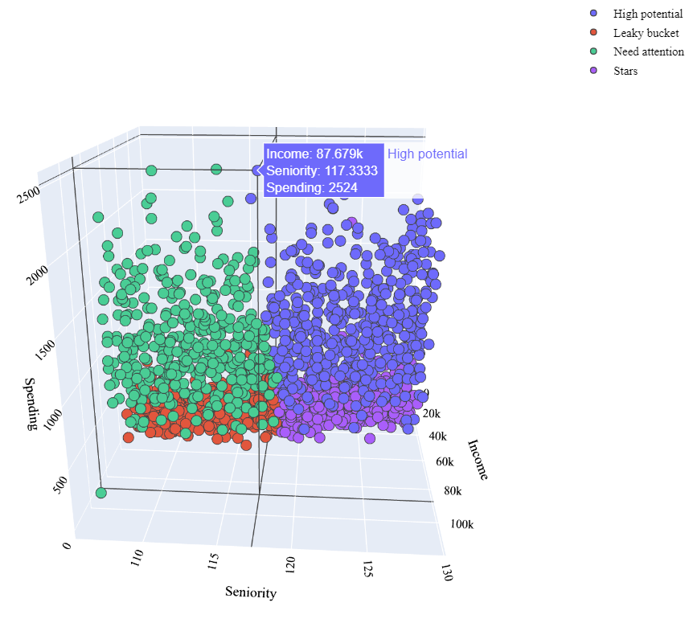

## Background

In the competitive landscape of modern business, understanding and catering to the diverse needs of customers is crucial for sustainable growth. A leading retail company, "XYZ Mart," aimed to enhance its marketing strategies by gaining deeper insights into customer behavior and preferences. As part of this endeavor, the company embarked on a project to analyze customer personalities and segment them effectively.

## Problem Statement

XYZ Mart faced challenges in effectively targeting its marketing efforts due to a lack of precise customer segmentation. Traditional demographic-based approaches were proving inadequate in capturing the nuanced preferences and behaviors of individual customers. Thus, the company sought a data-driven solution to segment customers based on their personalities and preferences, enabling personalized marketing strategies.

## Objective
The primary objective of the project was to develop a robust customer segmentation framework based on personality traits and preferences.

## Methodology and Framework of Analysis

### Data Collection
Acquired transactional data, customer demographics, and behavioral data from XYZ Mart's database. Data can be accessed [here](https://github.com/sahaavi/Customer-Personality-Analysis/tree/main/dataset).
### Exploratory Data Analysis (EDA)
Analyzed the distribution of customer attributes such as age, gender, and location. Identified outliers and missing values for data preprocessing. Explored correlations between different variables to gain initial insights.

Some screenshots of EDA:

### Feature Engineering
Engineered new features such as purchase frequency, average transaction value, and product category preferences. Transformed categorical variables into numerical representations using techniques like one-hot encoding.

### Model Development
Implemented a Gaussian Mixture Model (GMM) to cluster customers based on their purchasing patterns and preferences. 

To take a look at the clustering of customers in the dataset, I’ll define the segments of the clients. Here we will use 4 equally weighted customer segments:

**Stars**: Old customers with high income and high spending nature.  
**Need Attention**: New customers with below-average income and low spending nature.   
**High Potential**: New customers with high income and high spending nature.  
**Leaky Bucket**: Old customers with below-average income and a low spending nature.

Applied the Apriori algorithm to identify association rules among frequently purchased items.

Here, you can see that frequent consumers of fruits are more likely to also be frequent consumers of sweets. Because in the top 5 results, we can observe frequent consumers of fruits listed on the left-hand side.

### Validation and Evaluation
Split the dataset into training and validation sets to assess the performance of the models. Evaluated the clustering results using metrics such as silhouette score and adjusted Rand index. Conducted A/B testing to measure the effectiveness of personalized marketing strategies based on the developed segmentation.

### Documentation and Presentation
Documented the entire process, including data preprocessing, model development, and evaluation. Prepared a detailed report highlighting key findings, insights, and recommendations. Presented the findings to stakeholders, emphasizing the potential impact on marketing strategies and revenue growth.

## Conclusion
The implementation of advanced data analytics techniques enabled XYZ Mart to gain actionable insights into customer behavior and preferences. By leveraging the developed segmentation framework, the company could tailor its marketing strategies to individual customer segments, resulting in improved customer engagement, higher conversion rates, and enhanced revenue growth.
